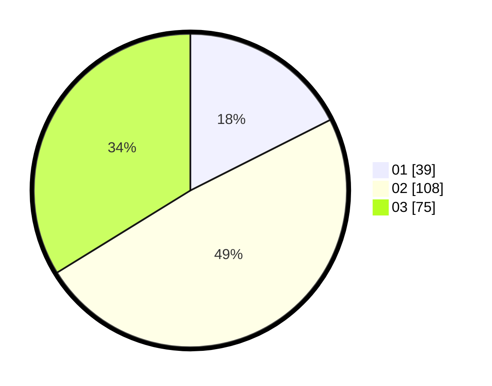

# Hasil

Hasil perolehan suara paslon dapat dilihat pada file paslon-01.txt, paslon-02.txt, dan paslon-03.txt.

Jika tidak ada, artinya data tersebut belum ada pada SIREKAP.

## Perolehan Suara

 * Paslon 01: **39**.
 * Paslon 02: **108**.
 * Paslon 03: **75**.

## Foto C Plano

https://sirekap-obj-formc.kpu.go.id/e75e/pemilu/ppwp/31/75/08/10/03/3175081003088-20240215-044341--2f127549-661c-4df9-9d44-56a4a79b6a1f.jpg

https://sirekap-obj-formc.kpu.go.id/e75e/pemilu/ppwp/31/75/08/10/03/3175081003088-20240215-044528--f1947db9-472f-453c-9e81-c70d718d263c.jpg

https://sirekap-obj-formc.kpu.go.id/e75e/pemilu/ppwp/31/75/08/10/03/3175081003088-20240215-044441--79c0f633-eee7-4ed5-99c2-01072963c079.jpg
