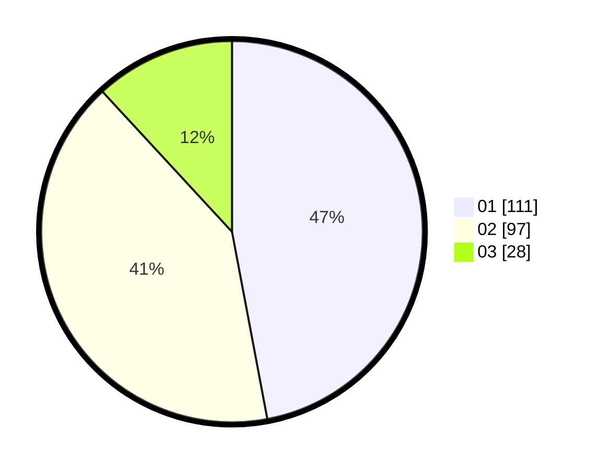

# Hasil

Hasil perolehan suara paslon dapat dilihat pada file paslon-01.txt, paslon-02.txt, dan paslon-03.txt.

Jika tidak ada, artinya data tersebut belum ada pada SIREKAP.

## Perolehan Suara

 * Paslon 01: **111**.
 * Paslon 02: **97**.
 * Paslon 03: **28**.

## Foto C Plano

https://sirekap-obj-formc.kpu.go.id/8440/pemilu/ppwp/31/75/08/10/03/3175081003091-20240214-214134--e5e154b5-9323-431c-acc6-98e6dd068e47.jpg

https://sirekap-obj-formc.kpu.go.id/8440/pemilu/ppwp/31/75/08/10/03/3175081003091-20240214-214140--ad66f2d5-8891-4a50-8293-8f2fb3313948.jpg

https://sirekap-obj-formc.kpu.go.id/8440/pemilu/ppwp/31/75/08/10/03/3175081003091-20240214-221229--1fcc5ca4-1c86-4fd5-b7f4-78b5afd4cd5e.jpg
