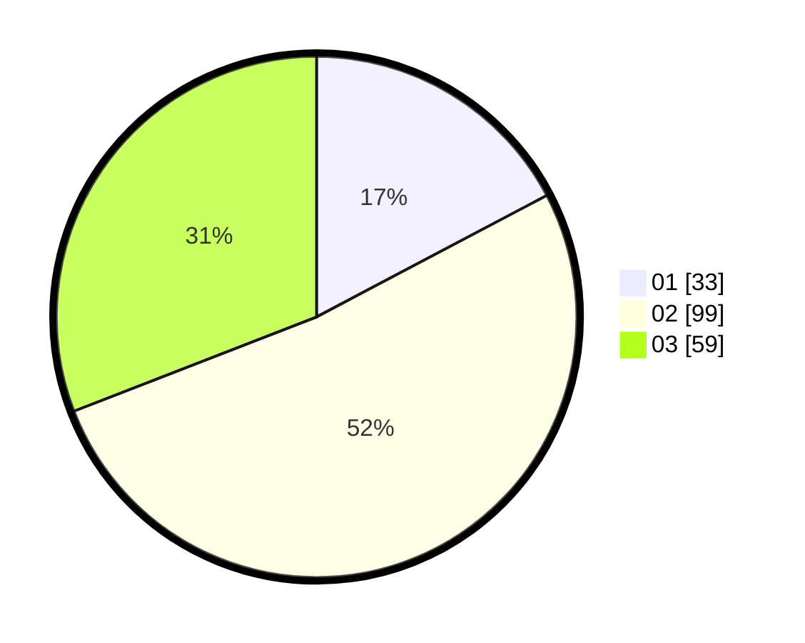

# Hasil

Hasil perolehan suara paslon dapat dilihat pada file paslon-01.txt, paslon-02.txt, dan paslon-03.txt.

Jika tidak ada, artinya data tersebut belum ada pada SIREKAP.

## Perolehan Suara

 * Paslon 01: **33**.
 * Paslon 02: **99**.
 * Paslon 03: **59**.

## Foto C Plano

https://sirekap-obj-formc.kpu.go.id/8b27/pemilu/ppwp/31/75/08/10/03/3175081003096-20240214-224005--f69480e1-2f83-409c-ad23-ced556f04959.jpg

https://sirekap-obj-formc.kpu.go.id/8b27/pemilu/ppwp/31/75/08/10/03/3175081003096-20240214-224123--e0ab5819-be15-459d-8900-76482fd12c59.jpg

https://sirekap-obj-formc.kpu.go.id/8b27/pemilu/ppwp/31/75/08/10/03/3175081003096-20240214-224156--7a2b6c37-c2a4-475b-8b97-c28901139182.jpg

## DATA PEMILIH TETAP

Jumlah pemilih dalam DPT: **276**.
 * L: **142**.
 * P: **134**.

## DATA PENGGUNA HAK PILIH

Jumlah pengguna hak pilih dalam DPT: **191**.
 * L: **94**.
 * P: **97**.

Jumlah pengguna hak pilih dalam DPTb: **3**.
 * L: **1**.
 * P: **2**.

Jumlah pengguna hak pilih dalam DPK: **2**.
 * L: **1**.
 * P: **1**.

Jumlah pengguna hak pilih: **196**.
 * L: **96**.
 * P: **100**.

## JUMLAH SUARA SAH DAN TIDAK SAH

JUMLAH SELURUH SUARA SAH: **191**.

JUMLAH SUARA TIDAK SAH: **5**.

JUMLAH SELURUH SUARA SAH DAN SUARA TIDAK SAH: **196**.
