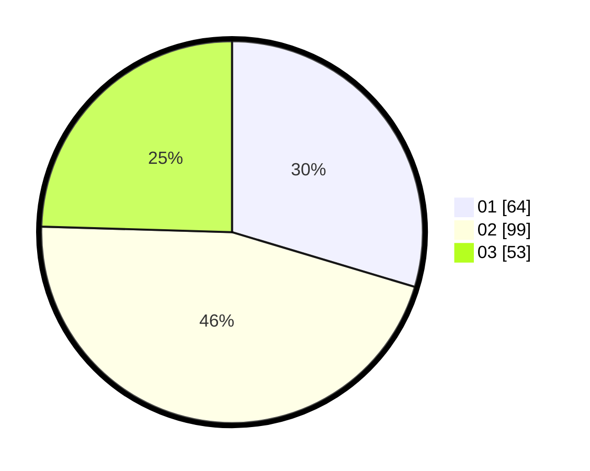

# Hasil

Hasil perolehan suara paslon dapat dilihat pada file paslon-01.txt, paslon-02.txt, dan paslon-03.txt.

Jika tidak ada, artinya data tersebut belum ada pada SIREKAP.

## Perolehan Suara

 * Paslon 01: **64**.
 * Paslon 02: **99**.
 * Paslon 03: **53**.

## Foto C Plano

https://sirekap-obj-formc.kpu.go.id/c61c/pemilu/ppwp/31/75/08/10/03/3175081003099-20240214-221719--4ada306b-b4de-45bb-a503-c65af1b70e0e.jpg

https://sirekap-obj-formc.kpu.go.id/c61c/pemilu/ppwp/31/75/08/10/03/3175081003099-20240214-215219--8d4f84b1-9d01-488c-8fa3-ec83429fcde4.jpg

https://sirekap-obj-formc.kpu.go.id/c61c/pemilu/ppwp/31/75/08/10/03/3175081003099-20240214-215424--c23e83b4-eb8f-406e-a1d5-aec8b8d42fa4.jpg
