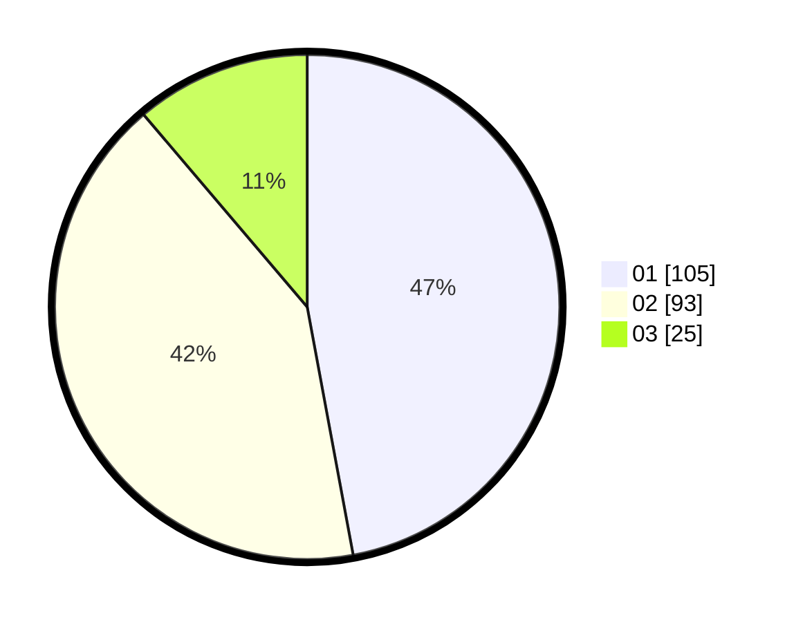

# Hasil

Hasil perolehan suara paslon dapat dilihat pada file paslon-01.txt, paslon-02.txt, dan paslon-03.txt.

Jika tidak ada, artinya data tersebut belum ada pada SIREKAP.

## Perolehan Suara

 * Paslon 01: **105**.
 * Paslon 02: **93**.
 * Paslon 03: **25**.

## Foto C Plano

https://sirekap-obj-formc.kpu.go.id/6427/pemilu/ppwp/31/75/08/10/03/3175081003103-20240214-233147--48e99ca6-f089-4012-953a-494d4ceaf87b.jpg

https://sirekap-obj-formc.kpu.go.id/6427/pemilu/ppwp/31/75/08/10/03/3175081003103-20240214-233317--77ab37fe-1a59-4738-89c5-753d4d3da61e.jpg

https://sirekap-obj-formc.kpu.go.id/6427/pemilu/ppwp/31/75/08/10/03/3175081003103-20240214-233439--479bf621-f4d6-42d3-89a2-92cc36cc8961.jpg

## DATA PEMILIH TETAP

Jumlah pemilih dalam DPT: **223**.
 * L: **98**.
 * P: **125**.

## DATA PENGGUNA HAK PILIH

Jumlah pengguna hak pilih dalam DPT: **294**.
 * L: **135**.
 * P: **159**.

Jumlah pengguna hak pilih dalam DPTb: **2**.
 * L: **1**.
 * P: **1**.

Jumlah pengguna hak pilih dalam DPK: **0**.
 * L: **0**.
 * P: **0**.

Jumlah pengguna hak pilih: **296**.
 * L: **136**.
 * P: **160**.

## JUMLAH SUARA SAH DAN TIDAK SAH

JUMLAH SELURUH SUARA SAH: **223**.

JUMLAH SUARA TIDAK SAH: **2**.

JUMLAH SELURUH SUARA SAH DAN SUARA TIDAK SAH: **225**.
