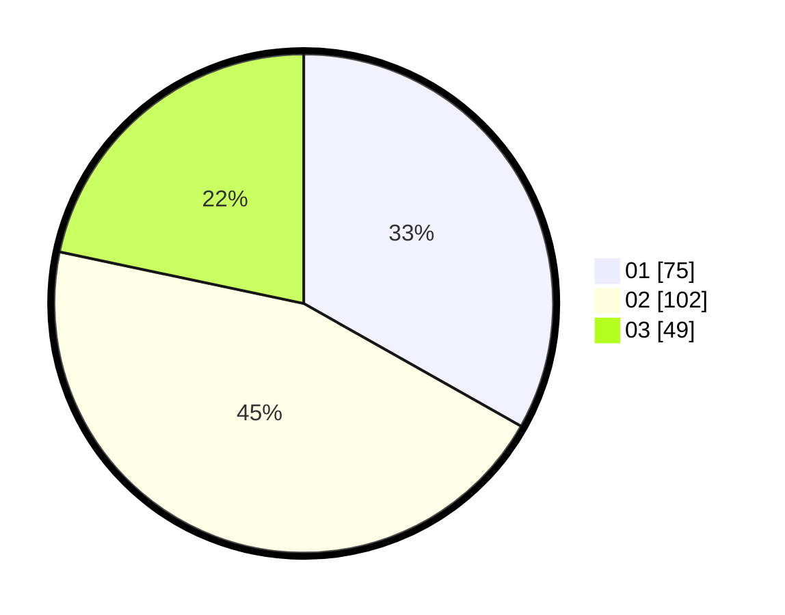

# Hasil

Hasil perolehan suara paslon dapat dilihat pada file paslon-01.txt, paslon-02.txt, dan paslon-03.txt.

Jika tidak ada, artinya data tersebut belum ada pada SIREKAP.

## Perolehan Suara

 * Paslon 01: **75**.
 * Paslon 02: **102**.
 * Paslon 03: **49**.

## Foto C Plano

https://sirekap-obj-formc.kpu.go.id/c6fb/pemilu/ppwp/31/75/08/10/03/3175081003106-20240214-230749--8f0767b3-6e34-4e93-83a0-afb385ee2689.jpg

https://sirekap-obj-formc.kpu.go.id/c6fb/pemilu/ppwp/31/75/08/10/03/3175081003106-20240214-230846--f2177dd3-5dc2-4ccb-935f-3267a5f83730.jpg

https://sirekap-obj-formc.kpu.go.id/c6fb/pemilu/ppwp/31/75/08/10/03/3175081003106-20240214-231028--7da946e5-dd4f-459a-9bc6-877598cc64fa.jpg
