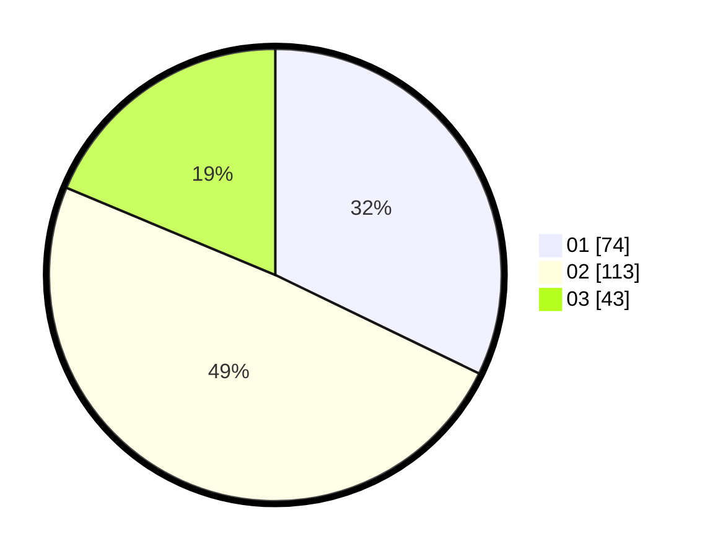

# Hasil

Hasil perolehan suara paslon dapat dilihat pada file paslon-01.txt, paslon-02.txt, dan paslon-03.txt.

Jika tidak ada, artinya data tersebut belum ada pada SIREKAP.

## Perolehan Suara

 * Paslon 01: **74**.
 * Paslon 02: **113**.
 * Paslon 03: **43**.

## Foto C Plano

https://sirekap-obj-formc.kpu.go.id/0261/pemilu/ppwp/31/75/08/10/03/3175081003107-20240216-123535--6e476242-7ac8-41d7-80be-6d9a46dedfb9.jpg

https://sirekap-obj-formc.kpu.go.id/0261/pemilu/ppwp/31/75/08/10/03/3175081003107-20240216-123539--bede9ae4-253e-49ec-91ea-53742dabcd76.jpg

https://sirekap-obj-formc.kpu.go.id/0261/pemilu/ppwp/31/75/08/10/03/3175081003107-20240216-123537--a67c39a4-208e-43d4-bff9-3492abb4ee2d.jpg

## DATA PEMILIH TETAP

Jumlah pemilih dalam DPT: **294**.
 * L: **150**.
 * P: **144**.

## DATA PENGGUNA HAK PILIH

Jumlah pengguna hak pilih dalam DPT: **222**.
 * L: **109**.
 * P: **113**.

Jumlah pengguna hak pilih dalam DPTb: **8**.
 * L: **4**.
 * P: **4**.

Jumlah pengguna hak pilih dalam DPK: **1**.
 * L: **0**.
 * P: **1**.

Jumlah pengguna hak pilih: **231**.
 * L: **113**.
 * P: **118**.

## JUMLAH SUARA SAH DAN TIDAK SAH

JUMLAH SELURUH SUARA SAH: **230**.

JUMLAH SUARA TIDAK SAH: **1**.

JUMLAH SELURUH SUARA SAH DAN SUARA TIDAK SAH: **231**.
