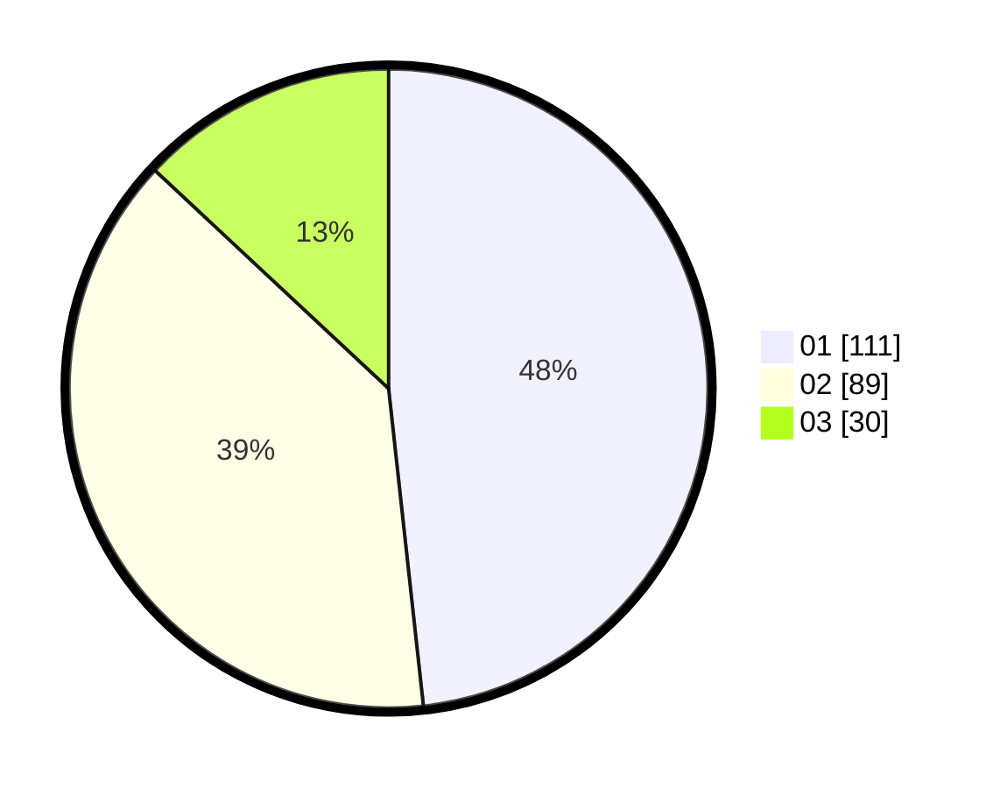

# Hasil

Hasil perolehan suara paslon dapat dilihat pada file paslon-01.txt, paslon-02.txt, dan paslon-03.txt.

Jika tidak ada, artinya data tersebut belum ada pada SIREKAP.

## Perolehan Suara

 * Paslon 01: **111**.
 * Paslon 02: **89**.
 * Paslon 03: **30**.

## Foto C Plano

https://sirekap-obj-formc.kpu.go.id/9e68/pemilu/ppwp/31/75/08/10/03/3175081003110-20240214-221726--f4c13b33-bffe-4d70-a4d9-2ab1d92a63f7.jpg

https://sirekap-obj-formc.kpu.go.id/9e68/pemilu/ppwp/31/75/08/10/03/3175081003110-20240214-221733--7eae11d7-4432-4b12-9695-a04284d2350f.jpg

https://sirekap-obj-formc.kpu.go.id/9e68/pemilu/ppwp/31/75/08/10/03/3175081003110-20240214-221736--9879e07b-63ef-4399-a2c4-f829d665fedb.jpg
