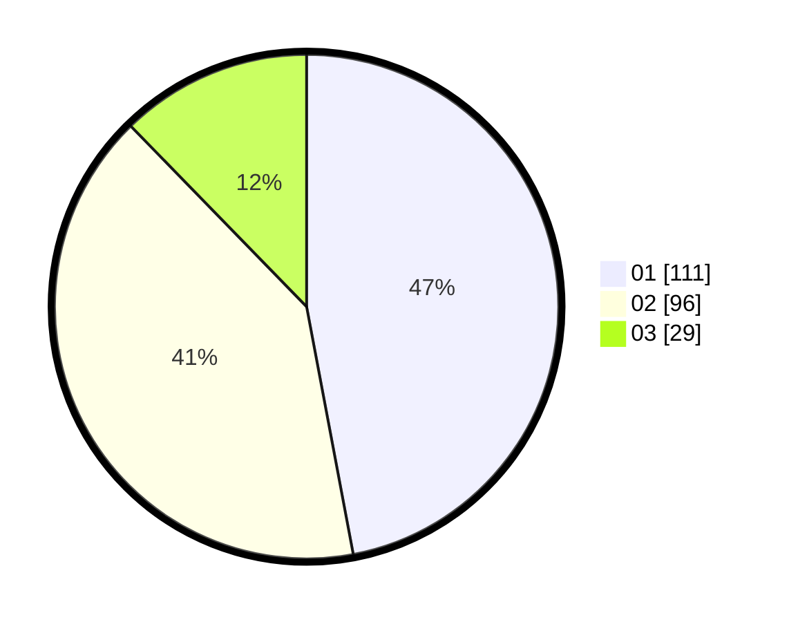

# Hasil

Hasil perolehan suara paslon dapat dilihat pada file paslon-01.txt, paslon-02.txt, dan paslon-03.txt.

Jika tidak ada, artinya data tersebut belum ada pada SIREKAP.

## Perolehan Suara

 * Paslon 01: **111**.
 * Paslon 02: **96**.
 * Paslon 03: **29**.

## Foto C Plano

https://sirekap-obj-formc.kpu.go.id/6980/pemilu/ppwp/31/75/08/10/03/3175081003114-20240214-231206--08ebd447-dcf0-4016-b2bf-e4878de186cd.jpg

https://sirekap-obj-formc.kpu.go.id/6980/pemilu/ppwp/31/75/08/10/03/3175081003114-20240214-231457--f8757362-01c3-46ec-8f8d-c14327f1336b.jpg

https://sirekap-obj-formc.kpu.go.id/6980/pemilu/ppwp/31/75/08/10/03/3175081003114-20240214-231706--c3c5ec43-4890-49f8-8484-6f273628ffcd.jpg
