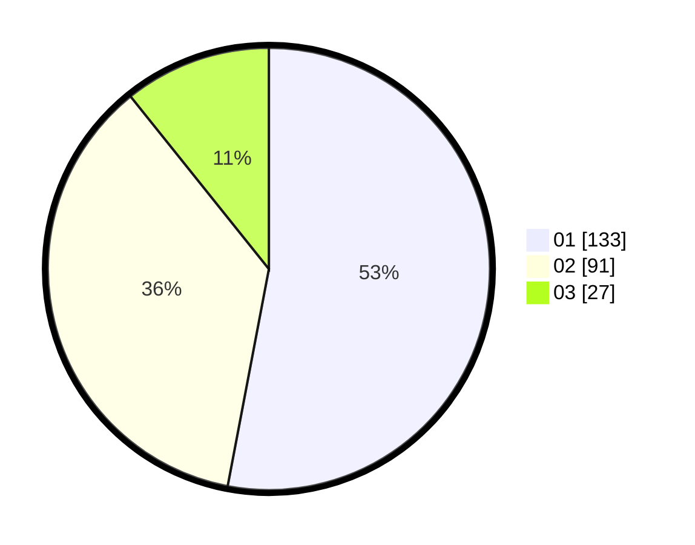

# Hasil

Hasil perolehan suara paslon dapat dilihat pada file paslon-01.txt, paslon-02.txt, dan paslon-03.txt.

Jika tidak ada, artinya data tersebut belum ada pada SIREKAP.

## Perolehan Suara

 * Paslon 01: **133**.
 * Paslon 02: **91**.
 * Paslon 03: **27**.

## Foto C Plano

https://sirekap-obj-formc.kpu.go.id/b9d5/pemilu/ppwp/31/75/08/10/03/3175081003118-20240215-234816--55ddc003-ab03-48f8-80e6-c338d4758153.jpg

https://sirekap-obj-formc.kpu.go.id/b9d5/pemilu/ppwp/31/75/08/10/03/3175081003118-20240215-234821--11374dfa-981a-4f96-8a20-03b4da6c9831.jpg

https://sirekap-obj-formc.kpu.go.id/b9d5/pemilu/ppwp/31/75/08/10/03/3175081003118-20240216-145939--809ee8c1-b414-4620-9ae0-69bdabc1c26b.jpg

## DATA PEMILIH TETAP

Jumlah pemilih dalam DPT: **277**.
 * L: **144**.
 * P: **133**.

## DATA PENGGUNA HAK PILIH

Jumlah pengguna hak pilih dalam DPT: **245**.
 * L: **125**.
 * P: **120**.

Jumlah pengguna hak pilih dalam DPTb: **2**.
 * L: **1**.
 * P: **1**.

Jumlah pengguna hak pilih dalam DPK: **5**.
 * L: **2**.
 * P: **3**.

Jumlah pengguna hak pilih: **252**.
 * L: **128**.
 * P: **124**.

## JUMLAH SUARA SAH DAN TIDAK SAH

JUMLAH SELURUH SUARA SAH: **251**.

JUMLAH SUARA TIDAK SAH: **1**.

JUMLAH SELURUH SUARA SAH DAN SUARA TIDAK SAH: **252**.
