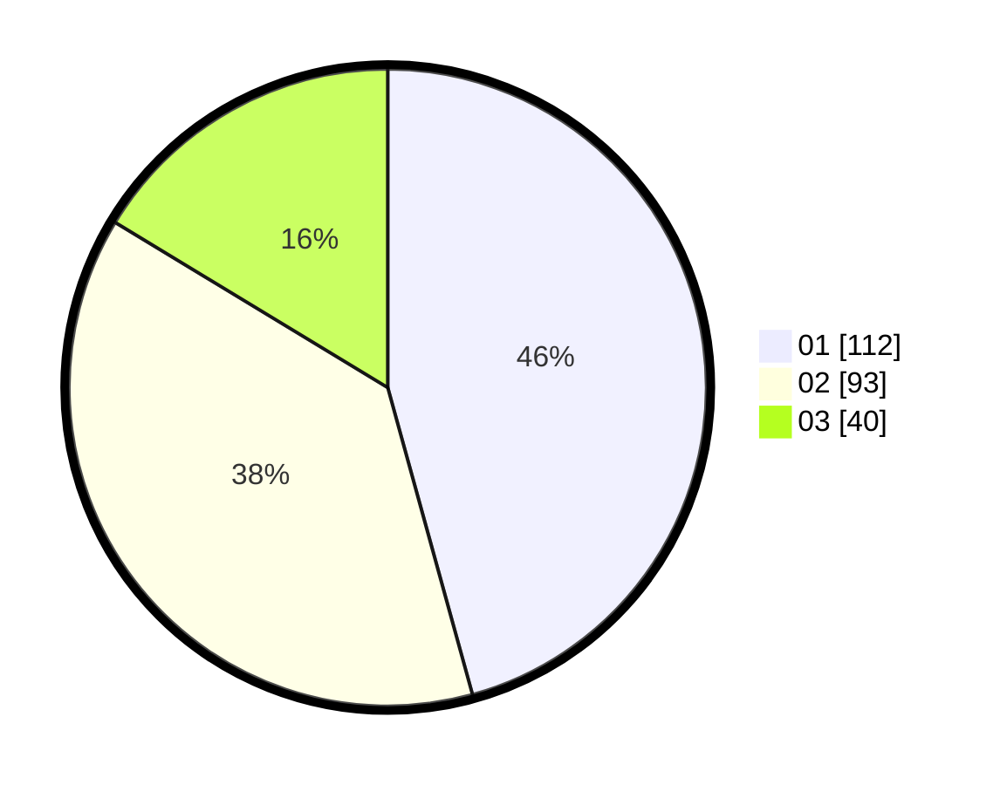

# Hasil

Hasil perolehan suara paslon dapat dilihat pada file paslon-01.txt, paslon-02.txt, dan paslon-03.txt.

Jika tidak ada, artinya data tersebut belum ada pada SIREKAP.

## Perolehan Suara

 * Paslon 01: **112**.
 * Paslon 02: **93**.
 * Paslon 03: **40**.

## Foto C Plano

https://sirekap-obj-formc.kpu.go.id/387f/pemilu/ppwp/31/75/08/10/03/3175081003120-20240216-111318--7a79de5a-ac6d-45b5-af2a-ae67dd60c47c.jpg

https://sirekap-obj-formc.kpu.go.id/387f/pemilu/ppwp/31/75/08/10/03/3175081003120-20240216-111322--f7e0d771-503e-4a31-bc68-5a6c8d41e71b.jpg

https://sirekap-obj-formc.kpu.go.id/387f/pemilu/ppwp/31/75/08/10/03/3175081003120-20240216-111320--b4b8ebe2-1c0d-4e29-b9fa-af1747a053a2.jpg

## DATA PEMILIH TETAP

Jumlah pemilih dalam DPT: **282**.
 * L: **145**.
 * P: **137**.

## DATA PENGGUNA HAK PILIH

Jumlah pengguna hak pilih dalam DPT: **282**.
 * L: **123**.
 * P: **123**.

Jumlah pengguna hak pilih dalam DPTb: **0**.
 * L: **0**.
 * P: **0**.

Jumlah pengguna hak pilih dalam DPK: **2**.
 * L: **1**.
 * P: **1**.

Jumlah pengguna hak pilih: **248**.
 * L: **124**.
 * P: **124**.

## JUMLAH SUARA SAH DAN TIDAK SAH

JUMLAH SELURUH SUARA SAH: **245**.

JUMLAH SUARA TIDAK SAH: **3**.

JUMLAH SELURUH SUARA SAH DAN SUARA TIDAK SAH: **248**.
