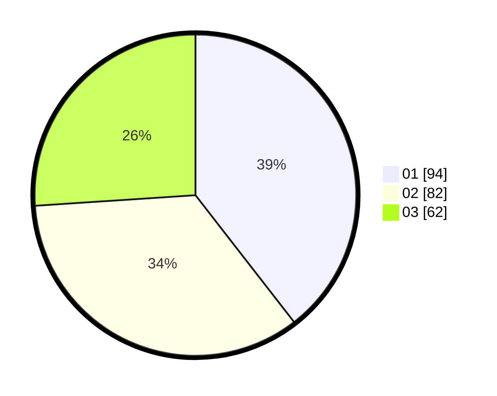

# Hasil

Hasil perolehan suara paslon dapat dilihat pada file paslon-01.txt, paslon-02.txt, dan paslon-03.txt.

Jika tidak ada, artinya data tersebut belum ada pada SIREKAP.

## Perolehan Suara

 * Paslon 01: **94**.
 * Paslon 02: **82**.
 * Paslon 03: **62**.

## Foto C Plano

https://sirekap-obj-formc.kpu.go.id/2eba/pemilu/ppwp/31/75/08/10/03/3175081003121-20240215-000411--4d5167f3-e8bc-4b06-a6d9-bb3753f2ce0b.jpg

https://sirekap-obj-formc.kpu.go.id/2eba/pemilu/ppwp/31/75/08/10/03/3175081003121-20240215-000456--3814bb49-8d65-4fc0-888d-288557873ee5.jpg

https://sirekap-obj-formc.kpu.go.id/2eba/pemilu/ppwp/31/75/08/10/03/3175081003121-20240215-000533--f882cd88-9345-4208-9a49-ecfbfce83ee8.jpg
