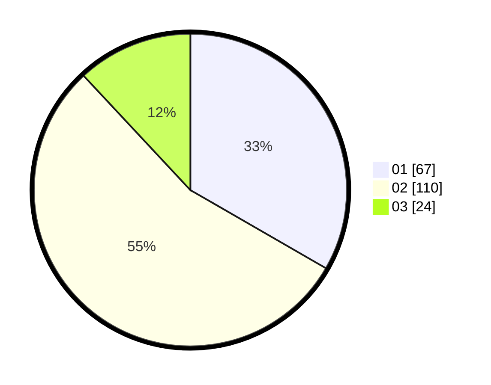

# Hasil

Hasil perolehan suara paslon dapat dilihat pada file paslon-01.txt, paslon-02.txt, dan paslon-03.txt.

Jika tidak ada, artinya data tersebut belum ada pada SIREKAP.

## Perolehan Suara

 * Paslon 01: **67**.
 * Paslon 02: **110**.
 * Paslon 03: **24**.

## Foto C Plano

https://sirekap-obj-formc.kpu.go.id/8168/pemilu/ppwp/31/75/08/10/03/3175081003130-20240216-004733--56ae6049-b14e-49af-b06d-3a6b38404f4e.jpg

https://sirekap-obj-formc.kpu.go.id/8168/pemilu/ppwp/31/75/08/10/03/3175081003130-20240216-004740--e904d1bc-a6ed-4d4a-9e48-26ad8048d1eb.jpg

https://sirekap-obj-formc.kpu.go.id/8168/pemilu/ppwp/31/75/08/10/03/3175081003130-20240216-004738--c785a10f-f3e9-4996-8ef6-19a7781dd1fb.jpg

## DATA PEMILIH TETAP

Jumlah pemilih dalam DPT: **256**.
 * L: **136**.
 * P: **120**.

## DATA PENGGUNA HAK PILIH

Jumlah pengguna hak pilih dalam DPT: **214**.
 * L: **112**.
 * P: **102**.

Jumlah pengguna hak pilih dalam DPTb: **0**.
 * L: **0**.
 * P: **0**.

Jumlah pengguna hak pilih dalam DPK: **1**.
 * L: **0**.
 * P: **1**.

Jumlah pengguna hak pilih: **215**.
 * L: **112**.
 * P: **103**.

## JUMLAH SUARA SAH DAN TIDAK SAH

JUMLAH SELURUH SUARA SAH: **201**.

JUMLAH SUARA TIDAK SAH: **14**.

JUMLAH SELURUH SUARA SAH DAN SUARA TIDAK SAH: **215**.
