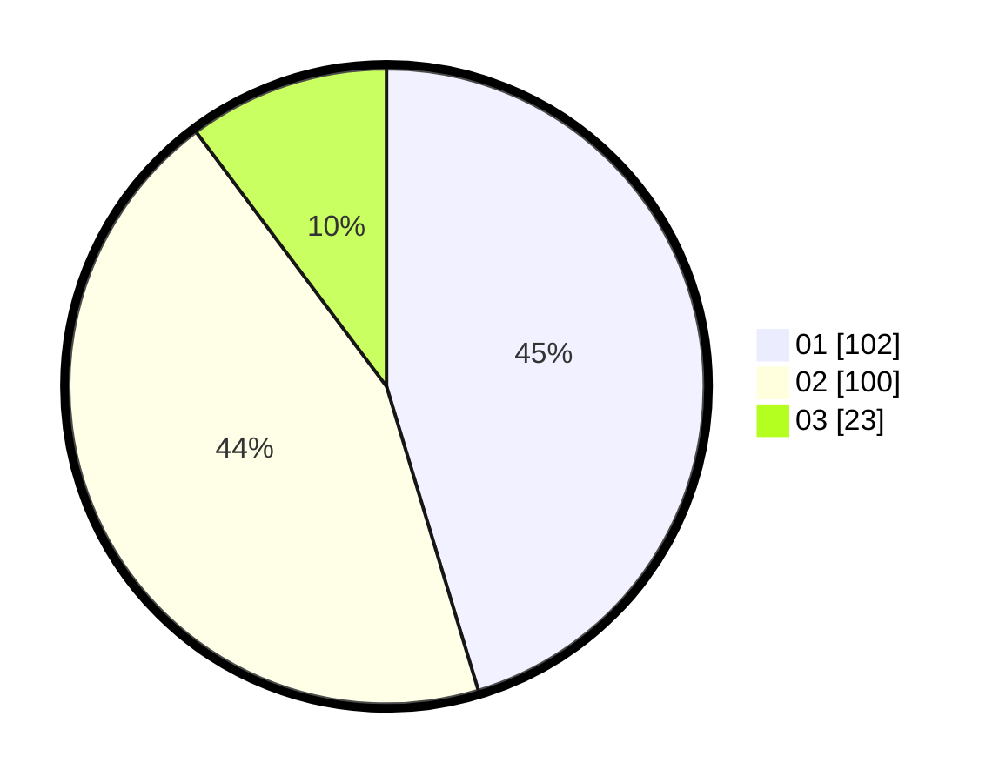

# Hasil

Hasil perolehan suara paslon dapat dilihat pada file paslon-01.txt, paslon-02.txt, dan paslon-03.txt.

Jika tidak ada, artinya data tersebut belum ada pada SIREKAP.

## Perolehan Suara

 * Paslon 01: **102**.
 * Paslon 02: **100**.
 * Paslon 03: **23**.

## Foto C Plano

https://sirekap-obj-formc.kpu.go.id/ba13/pemilu/ppwp/31/75/08/10/03/3175081003136-20240215-214829--e954e907-f781-47e1-ab91-45231d1dd0e0.jpg

https://sirekap-obj-formc.kpu.go.id/ba13/pemilu/ppwp/31/75/08/10/03/3175081003136-20240215-214831--756e6de5-4dab-42a6-8059-4d0ec874931b.jpg

https://sirekap-obj-formc.kpu.go.id/ba13/pemilu/ppwp/31/75/08/10/03/3175081003136-20240215-214830--63960841-94d8-41bd-b78e-c73282c78f00.jpg

## DATA PEMILIH TETAP

Jumlah pemilih dalam DPT: **227**.
 * L: **136**.
 * P: **141**.

## DATA PENGGUNA HAK PILIH

Jumlah pengguna hak pilih dalam DPT: **221**.
 * L: **102**.
 * P: **119**.

Jumlah pengguna hak pilih dalam DPTb: **4**.
 * L: **2**.
 * P: **2**.

Jumlah pengguna hak pilih dalam DPK: **2**.
 * L: **0**.
 * P: **2**.

Jumlah pengguna hak pilih: **227**.
 * L: **104**.
 * P: **123**.

## JUMLAH SUARA SAH DAN TIDAK SAH

JUMLAH SELURUH SUARA SAH: **225**.

JUMLAH SUARA TIDAK SAH: **2**.

JUMLAH SELURUH SUARA SAH DAN SUARA TIDAK SAH: **227**.
