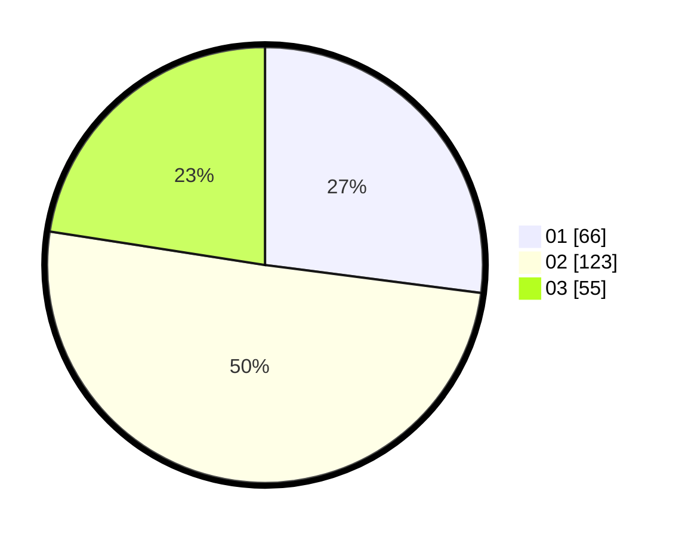

# Hasil

Hasil perolehan suara paslon dapat dilihat pada file paslon-01.txt, paslon-02.txt, dan paslon-03.txt.

Jika tidak ada, artinya data tersebut belum ada pada SIREKAP.

## Perolehan Suara

 * Paslon 01: **66**.
 * Paslon 02: **123**.
 * Paslon 03: **55**.

## Foto C Plano

https://sirekap-obj-formc.kpu.go.id/6580/pemilu/ppwp/31/75/08/10/03/3175081003140-20240214-195241--0101632e-d950-4a03-ba67-4d9dc2bd8cf9.jpg

https://sirekap-obj-formc.kpu.go.id/6580/pemilu/ppwp/31/75/08/10/03/3175081003140-20240214-213933--b9da7842-77f8-4c75-8cf5-2eb3d45e4b10.jpg

https://sirekap-obj-formc.kpu.go.id/6580/pemilu/ppwp/31/75/08/10/03/3175081003140-20240215-100427--49ea6cc8-0d1a-4f94-8ec4-b1ff26954bba.jpg

## DATA PEMILIH TETAP

Jumlah pemilih dalam DPT: **293**.
 * L: **142**.
 * P: **151**.

## DATA PENGGUNA HAK PILIH

Jumlah pengguna hak pilih dalam DPT: **245**.
 * L: **113**.
 * P: **132**.

Jumlah pengguna hak pilih dalam DPTb: **0**.
 * L: **0**.
 * P: **0**.

Jumlah pengguna hak pilih dalam DPK: **0**.
 * L: **0**.
 * P: **0**.

Jumlah pengguna hak pilih: **245**.
 * L: **113**.
 * P: **132**.

## JUMLAH SUARA SAH DAN TIDAK SAH

JUMLAH SELURUH SUARA SAH: **244**.

JUMLAH SUARA TIDAK SAH: **1**.

JUMLAH SELURUH SUARA SAH DAN SUARA TIDAK SAH: **245**.
