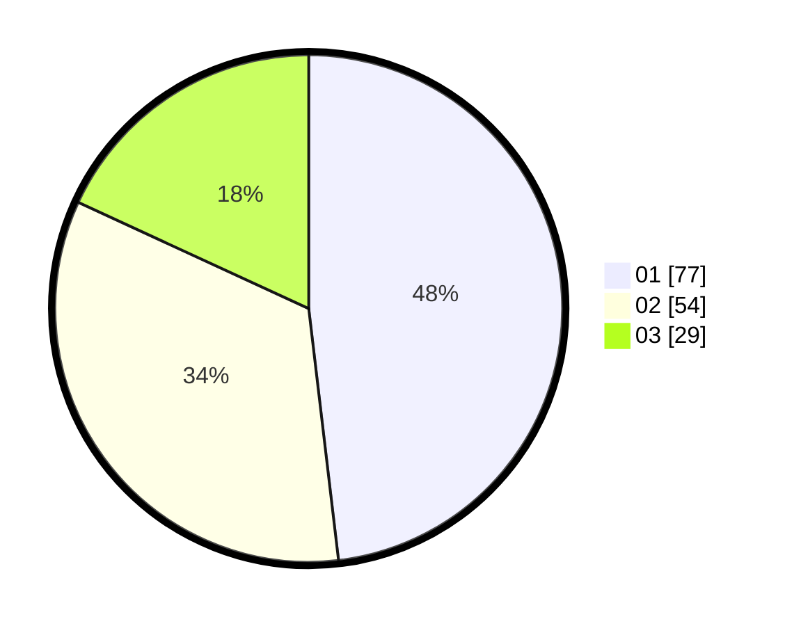

# Hasil

Hasil perolehan suara paslon dapat dilihat pada file paslon-01.txt, paslon-02.txt, dan paslon-03.txt.

Jika tidak ada, artinya data tersebut belum ada pada SIREKAP.

## Perolehan Suara

 * Paslon 01: **77**.
 * Paslon 02: **54**.
 * Paslon 03: **29**.

## Foto C Plano

https://sirekap-obj-formc.kpu.go.id/c702/pemilu/ppwp/31/75/08/10/03/3175081003151-20240214-191712--ea862859-eb7e-4319-a592-18de6d14758b.jpg

https://sirekap-obj-formc.kpu.go.id/c702/pemilu/ppwp/31/75/08/10/03/3175081003151-20240214-191830--1a6823eb-4f42-4c76-8e35-b5af6726551e.jpg

https://sirekap-obj-formc.kpu.go.id/c702/pemilu/ppwp/31/75/08/10/03/3175081003151-20240214-191908--640dc911-0c0b-4d18-9ad8-8d1867d69353.jpg

## DATA PEMILIH TETAP

Jumlah pemilih dalam DPT: **257**.
 * L: **128**.
 * P: **129**.

## DATA PENGGUNA HAK PILIH

Jumlah pengguna hak pilih dalam DPT: **161**.
 * L: **74**.
 * P: **87**.

Jumlah pengguna hak pilih dalam DPTb: **0**.
 * L: **0**.
 * P: **0**.

Jumlah pengguna hak pilih dalam DPK: **0**.
 * L: **0**.
 * P: **0**.

Jumlah pengguna hak pilih: **161**.
 * L: **74**.
 * P: **87**.

## JUMLAH SUARA SAH DAN TIDAK SAH

JUMLAH SELURUH SUARA SAH: **160**.

JUMLAH SUARA TIDAK SAH: **130**.

JUMLAH SELURUH SUARA SAH DAN SUARA TIDAK SAH: **290**.
