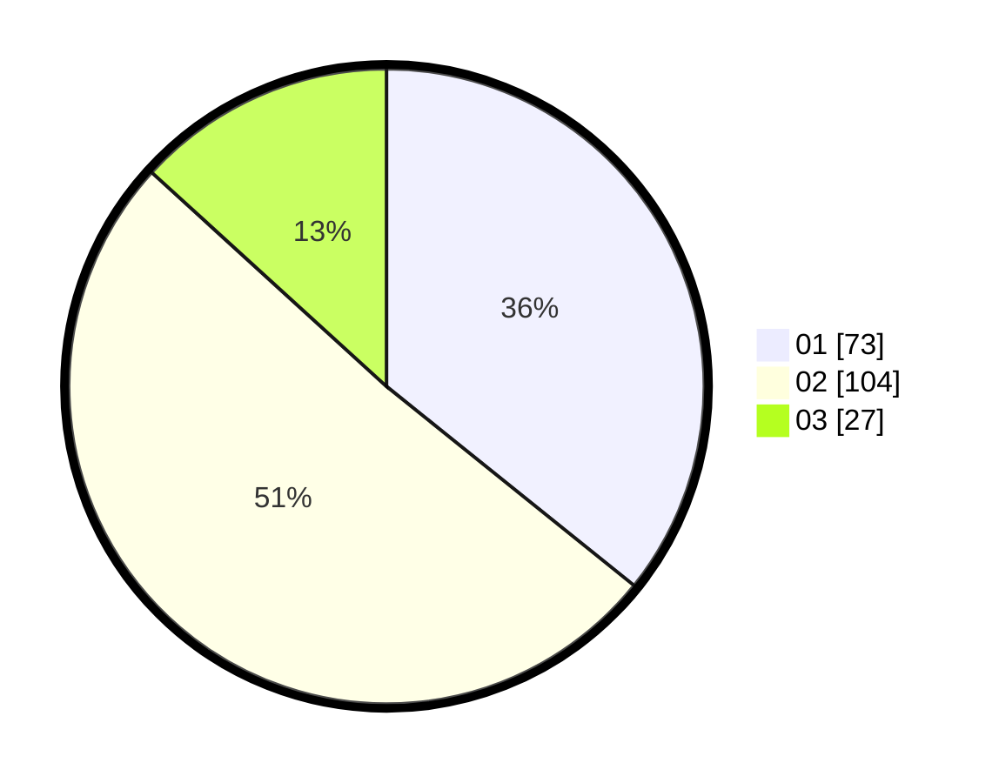

# Hasil

Hasil perolehan suara paslon dapat dilihat pada file paslon-01.txt, paslon-02.txt, dan paslon-03.txt.

Jika tidak ada, artinya data tersebut belum ada pada SIREKAP.

## Perolehan Suara

 * Paslon 01: **73**.
 * Paslon 02: **104**.
 * Paslon 03: **27**.

## Foto C Plano

https://sirekap-obj-formc.kpu.go.id/feb2/pemilu/ppwp/31/75/08/10/03/3175081003152-20240216-014541--88356739-0d00-4062-a190-cc5dc7878959.jpg

https://sirekap-obj-formc.kpu.go.id/feb2/pemilu/ppwp/31/75/08/10/03/3175081003152-20240216-014542--3b754262-a10c-4e2b-8eb9-98ae023bb099.jpg

https://sirekap-obj-formc.kpu.go.id/feb2/pemilu/ppwp/31/75/08/10/03/3175081003152-20240216-014542--477f8c36-f296-4da4-bedd-18f7b4b66d79.jpg

## DATA PEMILIH TETAP

Jumlah pemilih dalam DPT: **0**.
 * L: **0**.
 * P: **0**.

## DATA PENGGUNA HAK PILIH

Jumlah pengguna hak pilih dalam DPT: **0**.
 * L: **0**.
 * P: **0**.

Jumlah pengguna hak pilih dalam DPTb: **0**.
 * L: **0**.
 * P: **0**.

Jumlah pengguna hak pilih dalam DPK: **0**.
 * L: **0**.
 * P: **0**.

Jumlah pengguna hak pilih: **0**.
 * L: **0**.
 * P: **0**.

## JUMLAH SUARA SAH DAN TIDAK SAH

JUMLAH SELURUH SUARA SAH: **204**.

JUMLAH SUARA TIDAK SAH: **2**.

JUMLAH SELURUH SUARA SAH DAN SUARA TIDAK SAH: **206**.
