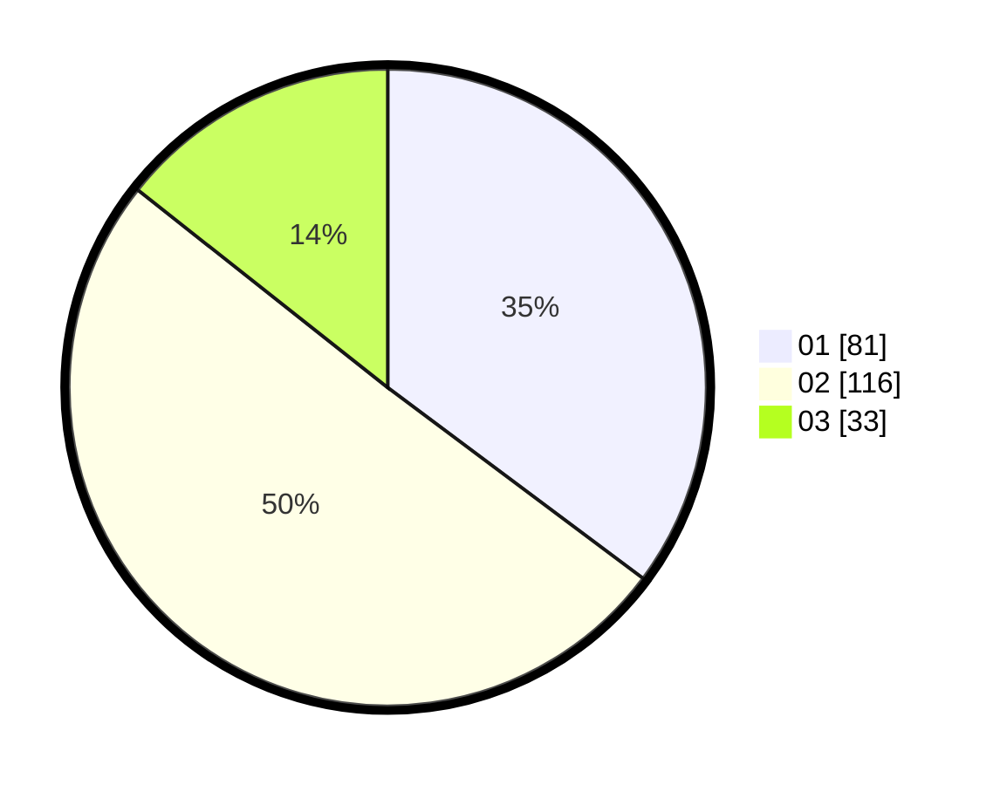

# Hasil

Hasil perolehan suara paslon dapat dilihat pada file paslon-01.txt, paslon-02.txt, dan paslon-03.txt.

Jika tidak ada, artinya data tersebut belum ada pada SIREKAP.

## Perolehan Suara

 * Paslon 01: **81**.
 * Paslon 02: **116**.
 * Paslon 03: **33**.

## Foto C Plano

https://sirekap-obj-formc.kpu.go.id/4521/pemilu/ppwp/31/75/08/10/03/3175081003156-20240214-155014--cf926b1b-a395-4403-b49a-1a52abe0e0d9.jpg

https://sirekap-obj-formc.kpu.go.id/4521/pemilu/ppwp/31/75/08/10/03/3175081003156-20240214-155311--7270ce21-ae0b-463b-91ba-8e352a8fe984.jpg

https://sirekap-obj-formc.kpu.go.id/4521/pemilu/ppwp/31/75/08/10/03/3175081003156-20240214-155022--999465a6-bf89-4f1c-8815-4e5184380af2.jpg

## DATA PEMILIH TETAP

Jumlah pemilih dalam DPT: **289**.
 * L: **141**.
 * P: **148**.

## DATA PENGGUNA HAK PILIH

Jumlah pengguna hak pilih dalam DPT: **227**.
 * L: **108**.
 * P: **119**.

Jumlah pengguna hak pilih dalam DPTb: **1**.
 * L: **0**.
 * P: **1**.

Jumlah pengguna hak pilih dalam DPK: **3**.
 * L: **2**.
 * P: **1**.

Jumlah pengguna hak pilih: **231**.
 * L: **110**.
 * P: **121**.

## JUMLAH SUARA SAH DAN TIDAK SAH

JUMLAH SELURUH SUARA SAH: **230**.

JUMLAH SUARA TIDAK SAH: **1**.

JUMLAH SELURUH SUARA SAH DAN SUARA TIDAK SAH: **231**.
