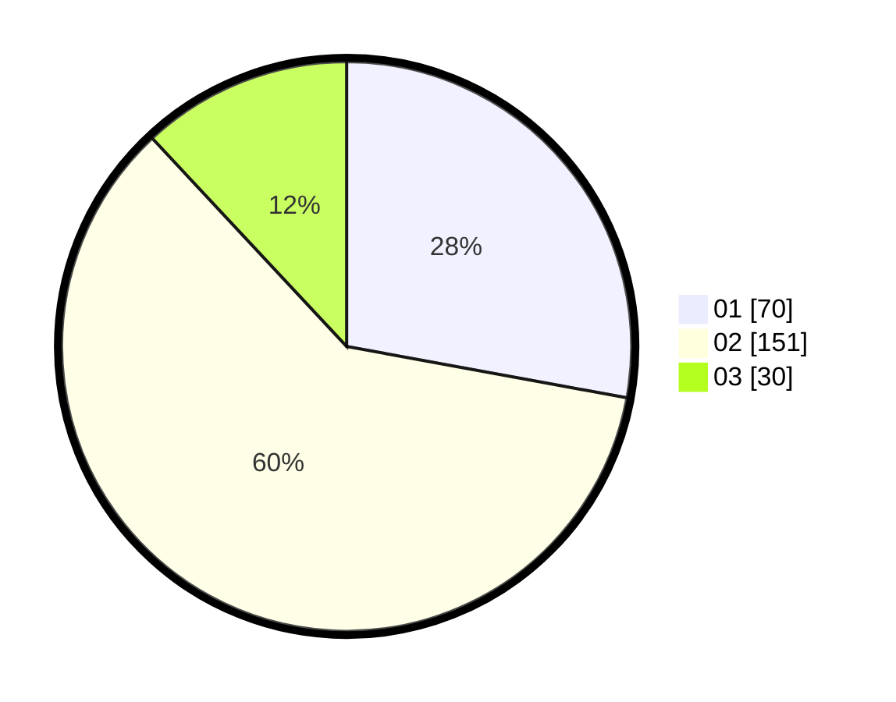

# Hasil

Hasil perolehan suara paslon dapat dilihat pada file paslon-01.txt, paslon-02.txt, dan paslon-03.txt.

Jika tidak ada, artinya data tersebut belum ada pada SIREKAP.

## Perolehan Suara

 * Paslon 01: **70**.
 * Paslon 02: **151**.
 * Paslon 03: **30**.

## Foto C Plano

https://sirekap-obj-formc.kpu.go.id/d008/pemilu/ppwp/31/75/08/10/04/3175081004001-20240216-154425--f87aeb5d-bf3d-44e4-92f2-afd5d6b8dcef.jpg

https://sirekap-obj-formc.kpu.go.id/d008/pemilu/ppwp/31/75/08/10/04/3175081004001-20240216-111705--cc46de04-3acc-4b3b-a3d9-73a211316369.jpg

https://sirekap-obj-formc.kpu.go.id/d008/pemilu/ppwp/31/75/08/10/04/3175081004001-20240216-111836--e0353722-1ebc-4062-b335-1ae1978485ef.jpg
