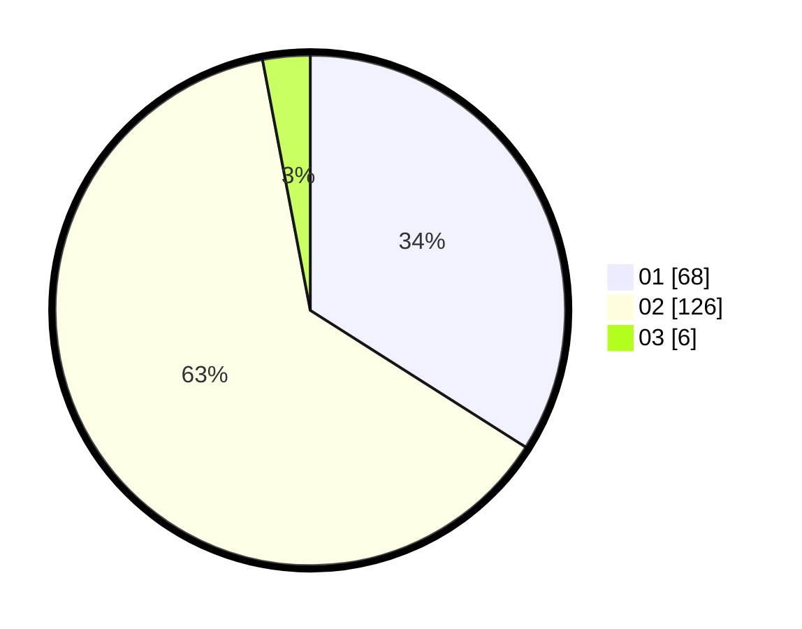

# Hasil

Hasil perolehan suara paslon dapat dilihat pada file paslon-01.txt, paslon-02.txt, dan paslon-03.txt.

Jika tidak ada, artinya data tersebut belum ada pada SIREKAP.

## Perolehan Suara

 * Paslon 01: **68**.
 * Paslon 02: **126**.
 * Paslon 03: **6**.

## Foto C Plano

https://sirekap-obj-formc.kpu.go.id/51f6/pemilu/ppwp/31/75/08/10/04/3175081004006-20240216-035938--f81ebf91-c27c-4e6b-96f0-3dddf24900f2.jpg

https://sirekap-obj-formc.kpu.go.id/51f6/pemilu/ppwp/31/75/08/10/04/3175081004006-20240216-035954--59520146-9beb-4f2c-9013-a157fe5a77c9.jpg

https://sirekap-obj-formc.kpu.go.id/51f6/pemilu/ppwp/31/75/08/10/04/3175081004006-20240216-035948--c58c4411-9656-4cc1-b8a3-a6e3deb9d64b.jpg

## DATA PEMILIH TETAP

Jumlah pemilih dalam DPT: **246**.
 * L: **63**.
 * P: **183**.

## DATA PENGGUNA HAK PILIH

Jumlah pengguna hak pilih dalam DPT: **198**.
 * L: **48**.
 * P: **150**.

Jumlah pengguna hak pilih dalam DPTb: **1**.
 * L: **0**.
 * P: **1**.

Jumlah pengguna hak pilih dalam DPK: **3**.
 * L: **1**.
 * P: **2**.

Jumlah pengguna hak pilih: **202**.
 * L: **49**.
 * P: **153**.

## JUMLAH SUARA SAH DAN TIDAK SAH

JUMLAH SELURUH SUARA SAH: **200**.

JUMLAH SUARA TIDAK SAH: **2**.

JUMLAH SELURUH SUARA SAH DAN SUARA TIDAK SAH: **202**.
