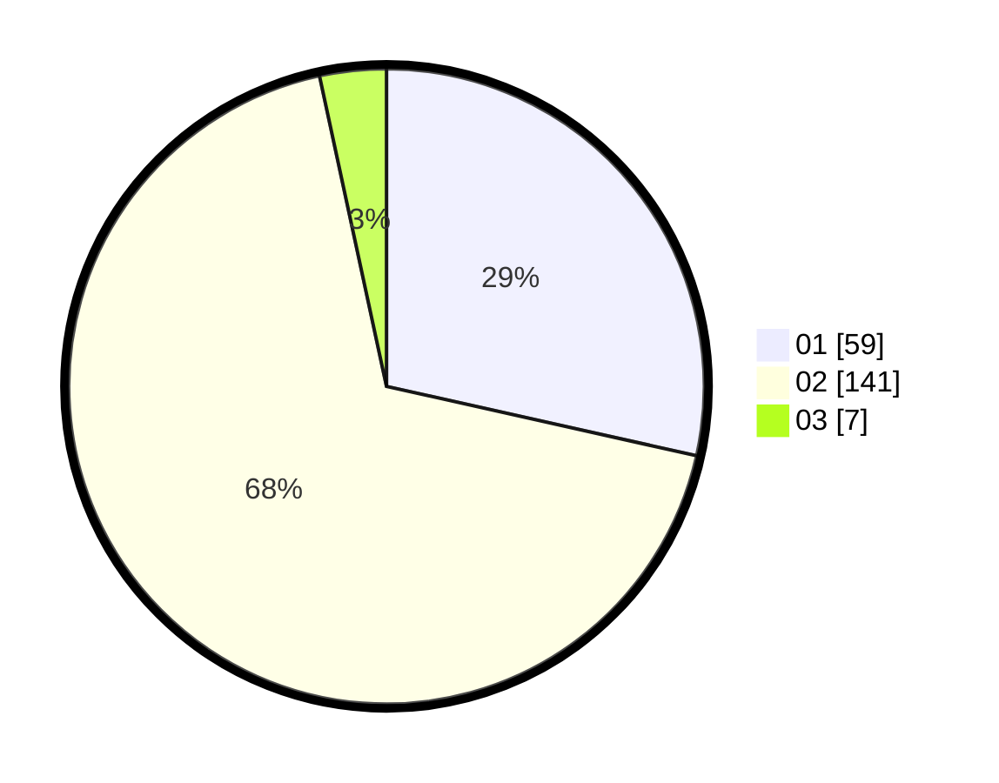

# Hasil

Hasil perolehan suara paslon dapat dilihat pada file paslon-01.txt, paslon-02.txt, dan paslon-03.txt.

Jika tidak ada, artinya data tersebut belum ada pada SIREKAP.

## Perolehan Suara

 * Paslon 01: **59**.
 * Paslon 02: **141**.
 * Paslon 03: **7**.

## Foto C Plano

https://sirekap-obj-formc.kpu.go.id/5fb0/pemilu/ppwp/31/75/08/10/04/3175081004010-20240216-023213--7b39027a-f9bd-4dee-b7eb-d0df532d37b5.jpg

https://sirekap-obj-formc.kpu.go.id/5fb0/pemilu/ppwp/31/75/08/10/04/3175081004010-20240216-023217--e6d501dc-d6b4-4c2a-9030-95dc0b513101.jpg

https://sirekap-obj-formc.kpu.go.id/5fb0/pemilu/ppwp/31/75/08/10/04/3175081004010-20240216-022432--6b03c772-0afb-4d81-aca8-64bf3b5b31f5.jpg

## DATA PEMILIH TETAP

Jumlah pemilih dalam DPT: **256**.
 * L: **73**.
 * P: **183**.

## DATA PENGGUNA HAK PILIH

Jumlah pengguna hak pilih dalam DPT: **200**.
 * L: **54**.
 * P: **146**.

Jumlah pengguna hak pilih dalam DPTb: **1**.
 * L: **0**.
 * P: **1**.

Jumlah pengguna hak pilih dalam DPK: **7**.
 * L: **6**.
 * P: **1**.

Jumlah pengguna hak pilih: **208**.
 * L: **60**.
 * P: **148**.

## JUMLAH SUARA SAH DAN TIDAK SAH

JUMLAH SELURUH SUARA SAH: **207**.

JUMLAH SUARA TIDAK SAH: **1**.

JUMLAH SELURUH SUARA SAH DAN SUARA TIDAK SAH: **208**.
