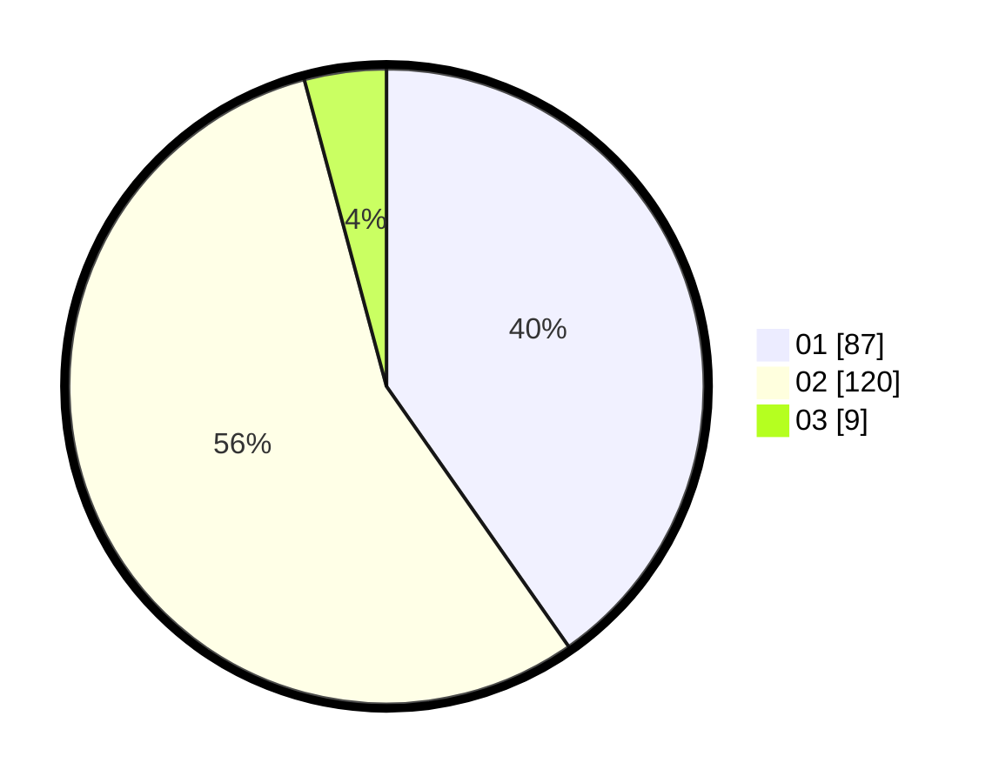

# Hasil

Hasil perolehan suara paslon dapat dilihat pada file paslon-01.txt, paslon-02.txt, dan paslon-03.txt.

Jika tidak ada, artinya data tersebut belum ada pada SIREKAP.

## Perolehan Suara

 * Paslon 01: **87**.
 * Paslon 02: **120**.
 * Paslon 03: **9**.

## Foto C Plano

https://sirekap-obj-formc.kpu.go.id/4e80/pemilu/ppwp/31/75/08/10/04/3175081004011-20240216-050908--cf0b5d8c-01ff-434a-b3ed-5ac1858131a2.jpg

https://sirekap-obj-formc.kpu.go.id/4e80/pemilu/ppwp/31/75/08/10/04/3175081004011-20240216-050909--7b7f00e4-b7dc-42c9-87c0-d9cfaa6178c3.jpg

https://sirekap-obj-formc.kpu.go.id/4e80/pemilu/ppwp/31/75/08/10/04/3175081004011-20240216-050909--7762b7e1-174f-400b-a6ff-1fad8c709fe7.jpg

## DATA PEMILIH TETAP

Jumlah pemilih dalam DPT: **260**.
 * L: **76**.
 * P: **184**.

## DATA PENGGUNA HAK PILIH

Jumlah pengguna hak pilih dalam DPT: **213**.
 * L: **56**.
 * P: **157**.

Jumlah pengguna hak pilih dalam DPTb: **2**.
 * L: **0**.
 * P: **2**.

Jumlah pengguna hak pilih dalam DPK: **5**.
 * L: **2**.
 * P: **3**.

Jumlah pengguna hak pilih: **220**.
 * L: **58**.
 * P: **162**.

## JUMLAH SUARA SAH DAN TIDAK SAH

JUMLAH SELURUH SUARA SAH: **216**.

JUMLAH SUARA TIDAK SAH: **4**.

JUMLAH SELURUH SUARA SAH DAN SUARA TIDAK SAH: **220**.
