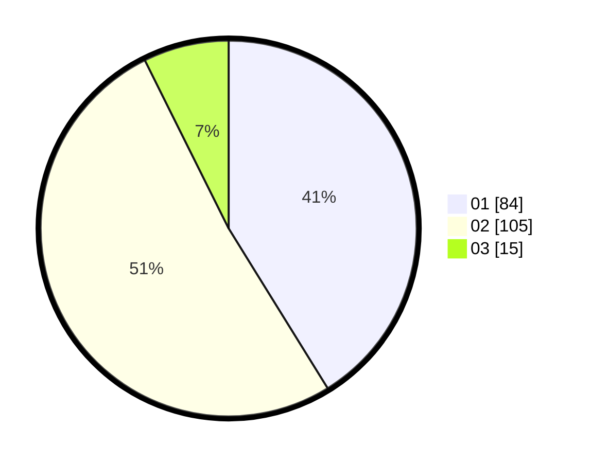

# Hasil

Hasil perolehan suara paslon dapat dilihat pada file paslon-01.txt, paslon-02.txt, dan paslon-03.txt.

Jika tidak ada, artinya data tersebut belum ada pada SIREKAP.

## Perolehan Suara

 * Paslon 01: **84**.
 * Paslon 02: **105**.
 * Paslon 03: **15**.

## Foto C Plano

https://sirekap-obj-formc.kpu.go.id/f9ac/pemilu/ppwp/31/75/08/10/04/3175081004016-20240214-225435--58ccb88c-1494-4f15-83dd-0b90057e786c.jpg

https://sirekap-obj-formc.kpu.go.id/f9ac/pemilu/ppwp/31/75/08/10/04/3175081004016-20240214-225511--e1075bae-8c07-491f-8dc6-1ec786d1957f.jpg

https://sirekap-obj-formc.kpu.go.id/f9ac/pemilu/ppwp/31/75/08/10/04/3175081004016-20240214-225622--1ecfecff-62e9-44d0-862b-083fa3c350cc.jpg
