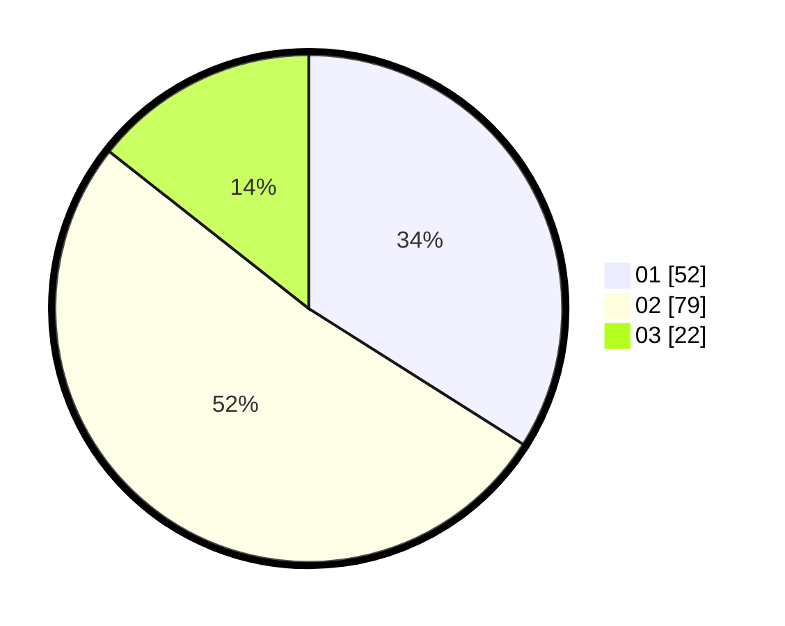

# Hasil

Hasil perolehan suara paslon dapat dilihat pada file paslon-01.txt, paslon-02.txt, dan paslon-03.txt.

Jika tidak ada, artinya data tersebut belum ada pada SIREKAP.

## Perolehan Suara

 * Paslon 01: **52**.
 * Paslon 02: **79**.
 * Paslon 03: **22**.

## Foto C Plano

https://sirekap-obj-formc.kpu.go.id/0169/pemilu/ppwp/31/75/08/10/04/3175081004018-20240216-000815--334914bc-e6d1-4ec9-a972-2c43bc33e65d.jpg

https://sirekap-obj-formc.kpu.go.id/0169/pemilu/ppwp/31/75/08/10/04/3175081004018-20240216-000817--0bf9fd48-4c1a-43df-bb25-160d662f8e12.jpg

https://sirekap-obj-formc.kpu.go.id/0169/pemilu/ppwp/31/75/08/10/04/3175081004018-20240216-000816--86e19915-9646-4cbf-b05b-4af48db26194.jpg

## DATA PEMILIH TETAP

Jumlah pemilih dalam DPT: **193**.
 * L: **74**.
 * P: **119**.

## DATA PENGGUNA HAK PILIH

Jumlah pengguna hak pilih dalam DPT: **151**.
 * L: **51**.
 * P: **100**.

Jumlah pengguna hak pilih dalam DPTb: **0**.
 * L: **0**.
 * P: **0**.

Jumlah pengguna hak pilih dalam DPK: **6**.
 * L: **2**.
 * P: **4**.

Jumlah pengguna hak pilih: **157**.
 * L: **53**.
 * P: **104**.

## JUMLAH SUARA SAH DAN TIDAK SAH

JUMLAH SELURUH SUARA SAH: **153**.

JUMLAH SUARA TIDAK SAH: **4**.

JUMLAH SELURUH SUARA SAH DAN SUARA TIDAK SAH: **157**.
