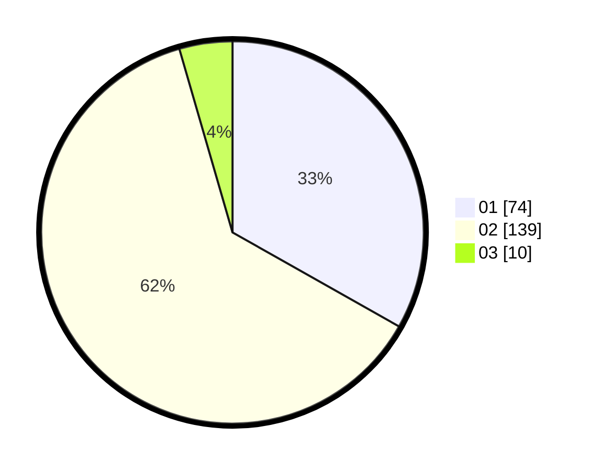

# Hasil

Hasil perolehan suara paslon dapat dilihat pada file paslon-01.txt, paslon-02.txt, dan paslon-03.txt.

Jika tidak ada, artinya data tersebut belum ada pada SIREKAP.

## Perolehan Suara

 * Paslon 01: **74**.
 * Paslon 02: **139**.
 * Paslon 03: **10**.

## Foto C Plano

https://sirekap-obj-formc.kpu.go.id/f8f4/pemilu/ppwp/31/75/08/10/04/3175081004019-20240216-114858--6f8702b1-43f2-4c06-a2ac-f4f59926970a.jpg

https://sirekap-obj-formc.kpu.go.id/f8f4/pemilu/ppwp/31/75/08/10/04/3175081004019-20240216-114901--998877ee-665a-42e7-9bb0-4fe8ebf40911.jpg

https://sirekap-obj-formc.kpu.go.id/f8f4/pemilu/ppwp/31/75/08/10/04/3175081004019-20240216-114859--fa9c92e7-1fe7-4e9d-ae6f-5fcf7bd1a75a.jpg

## DATA PEMILIH TETAP

Jumlah pemilih dalam DPT: **250**.
 * L: **77**.
 * P: **173**.

## DATA PENGGUNA HAK PILIH

Jumlah pengguna hak pilih dalam DPT: **214**.
 * L: **63**.
 * P: **151**.

Jumlah pengguna hak pilih dalam DPTb: **4**.
 * L: **1**.
 * P: **3**.

Jumlah pengguna hak pilih dalam DPK: **11**.
 * L: **6**.
 * P: **5**.

Jumlah pengguna hak pilih: **229**.
 * L: **70**.
 * P: **159**.

## JUMLAH SUARA SAH DAN TIDAK SAH

JUMLAH SELURUH SUARA SAH: **223**.

JUMLAH SUARA TIDAK SAH: **6**.

JUMLAH SELURUH SUARA SAH DAN SUARA TIDAK SAH: **229**.
