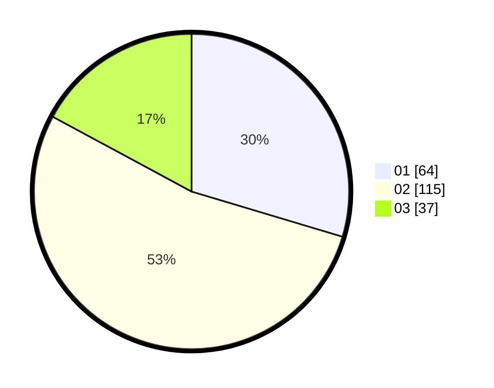

# Hasil

Hasil perolehan suara paslon dapat dilihat pada file paslon-01.txt, paslon-02.txt, dan paslon-03.txt.

Jika tidak ada, artinya data tersebut belum ada pada SIREKAP.

## Perolehan Suara

 * Paslon 01: **64**.
 * Paslon 02: **115**.
 * Paslon 03: **37**.

## Foto C Plano

https://sirekap-obj-formc.kpu.go.id/ff97/pemilu/ppwp/31/75/08/10/04/3175081004027-20240214-211221--c1d23e16-b38f-42ca-96c0-ad61bbbee576.jpg

https://sirekap-obj-formc.kpu.go.id/ff97/pemilu/ppwp/31/75/08/10/04/3175081004027-20240214-211340--17b20c0e-ccb2-46f3-8261-35cd0b22b32a.jpg

https://sirekap-obj-formc.kpu.go.id/ff97/pemilu/ppwp/31/75/08/10/04/3175081004027-20240214-211508--24a23348-17c0-4319-9819-934033c6c98a.jpg
