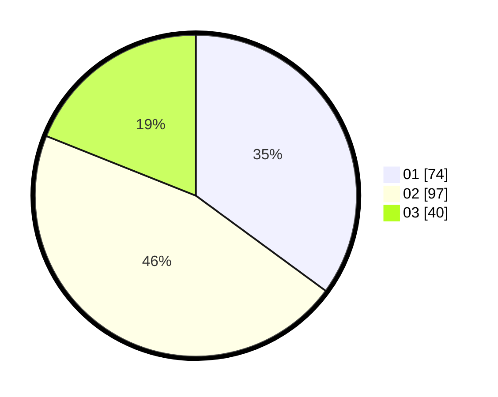

# Hasil

Hasil perolehan suara paslon dapat dilihat pada file paslon-01.txt, paslon-02.txt, dan paslon-03.txt.

Jika tidak ada, artinya data tersebut belum ada pada SIREKAP.

## Perolehan Suara

 * Paslon 01: **74**.
 * Paslon 02: **97**.
 * Paslon 03: **40**.

## Foto C Plano

https://sirekap-obj-formc.kpu.go.id/1d00/pemilu/ppwp/31/75/08/10/04/3175081004028-20240214-155037--b93749ea-9913-4bd8-84de-1f08b3285c40.jpg

https://sirekap-obj-formc.kpu.go.id/1d00/pemilu/ppwp/31/75/08/10/04/3175081004028-20240214-160100--c11ff5e8-1068-4034-b752-bf17d184c8d5.jpg

https://sirekap-obj-formc.kpu.go.id/1d00/pemilu/ppwp/31/75/08/10/04/3175081004028-20240214-155107--7e51823a-82e1-417e-af6b-0b210a2ec52b.jpg

## DATA PEMILIH TETAP

Jumlah pemilih dalam DPT: **263**.
 * L: **123**.
 * P: **140**.

## DATA PENGGUNA HAK PILIH

Jumlah pengguna hak pilih dalam DPT: **213**.
 * L: **96**.
 * P: **117**.

Jumlah pengguna hak pilih dalam DPTb: **0**.
 * L: **0**.
 * P: **0**.

Jumlah pengguna hak pilih dalam DPK: **1**.
 * L: **0**.
 * P: **1**.

Jumlah pengguna hak pilih: **214**.
 * L: **96**.
 * P: **118**.

## JUMLAH SUARA SAH DAN TIDAK SAH

JUMLAH SELURUH SUARA SAH: **211**.

JUMLAH SUARA TIDAK SAH: **3**.

JUMLAH SELURUH SUARA SAH DAN SUARA TIDAK SAH: **214**.
