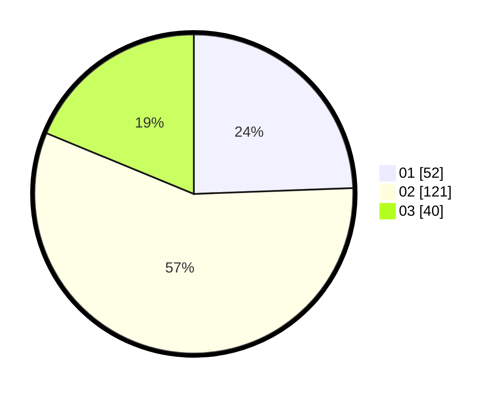

# Hasil

Hasil perolehan suara paslon dapat dilihat pada file paslon-01.txt, paslon-02.txt, dan paslon-03.txt.

Jika tidak ada, artinya data tersebut belum ada pada SIREKAP.

## Perolehan Suara

 * Paslon 01: **52**.
 * Paslon 02: **121**.
 * Paslon 03: **40**.

## Foto C Plano

https://sirekap-obj-formc.kpu.go.id/fda9/pemilu/ppwp/31/75/08/10/04/3175081004034-20240214-160123--8ac0a9e4-3db0-432a-9951-a6b6cb669698.jpg

https://sirekap-obj-formc.kpu.go.id/fda9/pemilu/ppwp/31/75/08/10/04/3175081004034-20240214-162223--d27cc8d0-c2ff-419a-a4a5-028080d5e133.jpg

https://sirekap-obj-formc.kpu.go.id/fda9/pemilu/ppwp/31/75/08/10/04/3175081004034-20240214-162228--1b398ac2-6643-4ff2-8203-0fb0cd44b818.jpg

## DATA PEMILIH TETAP

Jumlah pemilih dalam DPT: **260**.
 * L: **147**.
 * P: **113**.

## DATA PENGGUNA HAK PILIH

Jumlah pengguna hak pilih dalam DPT: **213**.
 * L: **117**.
 * P: **96**.

Jumlah pengguna hak pilih dalam DPTb: **0**.
 * L: **0**.
 * P: **0**.

Jumlah pengguna hak pilih dalam DPK: **1**.
 * L: **1**.
 * P: **0**.

Jumlah pengguna hak pilih: **214**.
 * L: **118**.
 * P: **96**.

## JUMLAH SUARA SAH DAN TIDAK SAH

JUMLAH SELURUH SUARA SAH: **213**.

JUMLAH SUARA TIDAK SAH: **1**.

JUMLAH SELURUH SUARA SAH DAN SUARA TIDAK SAH: **214**.
