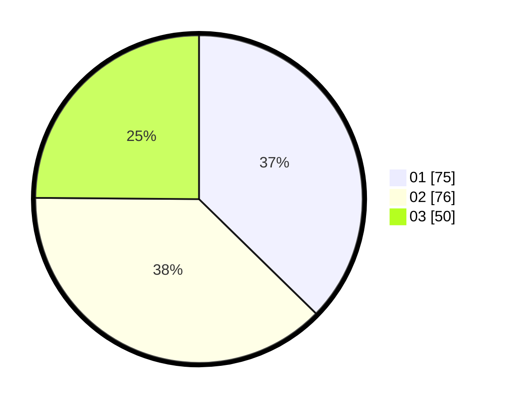

# Hasil

Hasil perolehan suara paslon dapat dilihat pada file paslon-01.txt, paslon-02.txt, dan paslon-03.txt.

Jika tidak ada, artinya data tersebut belum ada pada SIREKAP.

## Perolehan Suara

 * Paslon 01: **75**.
 * Paslon 02: **76**.
 * Paslon 03: **50**.

## Foto C Plano

https://sirekap-obj-formc.kpu.go.id/3ef3/pemilu/ppwp/31/75/08/10/04/3175081004035-20240214-213542--e06dde64-5f48-4562-8a27-e1111a84b971.jpg

https://sirekap-obj-formc.kpu.go.id/3ef3/pemilu/ppwp/31/75/08/10/04/3175081004035-20240214-213650--e4607c1f-d8a9-4314-b283-1414b44a438b.jpg

https://sirekap-obj-formc.kpu.go.id/3ef3/pemilu/ppwp/31/75/08/10/04/3175081004035-20240214-213747--acf30b84-0889-4d56-a95c-02235d9f8ba7.jpg
