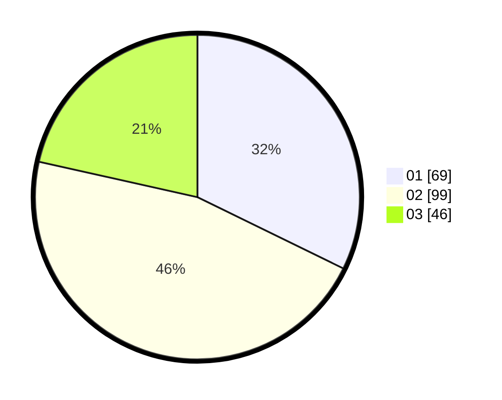

# Hasil

Hasil perolehan suara paslon dapat dilihat pada file paslon-01.txt, paslon-02.txt, dan paslon-03.txt.

Jika tidak ada, artinya data tersebut belum ada pada SIREKAP.

## Perolehan Suara

 * Paslon 01: **69**.
 * Paslon 02: **99**.
 * Paslon 03: **46**.

## Foto C Plano

https://sirekap-obj-formc.kpu.go.id/9712/pemilu/ppwp/31/75/08/10/04/3175081004036-20240215-012323--d00488eb-89ea-49a6-aaf8-b56bafda1146.jpg

https://sirekap-obj-formc.kpu.go.id/9712/pemilu/ppwp/31/75/08/10/04/3175081004036-20240215-012553--0c2518ad-6de7-4b73-921e-c1af00686906.jpg

https://sirekap-obj-formc.kpu.go.id/9712/pemilu/ppwp/31/75/08/10/04/3175081004036-20240215-012721--e1943420-fb45-477b-9e43-5ff307f49d51.jpg
