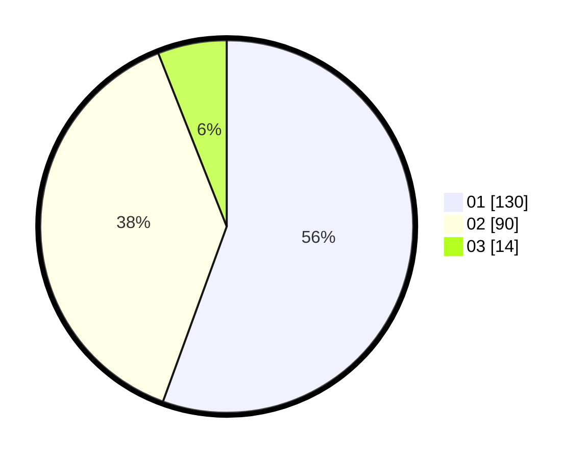

# Hasil

Hasil perolehan suara paslon dapat dilihat pada file paslon-01.txt, paslon-02.txt, dan paslon-03.txt.

Jika tidak ada, artinya data tersebut belum ada pada SIREKAP.

## Perolehan Suara

 * Paslon 01: **130**.
 * Paslon 02: **90**.
 * Paslon 03: **14**.

## Foto C Plano

https://sirekap-obj-formc.kpu.go.id/498a/pemilu/ppwp/31/75/08/10/04/3175081004038-20240214-233529--1c1489d5-e8ae-42cf-b195-4bfef5133207.jpg

https://sirekap-obj-formc.kpu.go.id/498a/pemilu/ppwp/31/75/08/10/04/3175081004038-20240214-233544--0b43239d-0192-497a-9201-6ee00e152451.jpg

https://sirekap-obj-formc.kpu.go.id/498a/pemilu/ppwp/31/75/08/10/04/3175081004038-20240214-233551--09923369-744b-45f3-a01f-27787d5babd6.jpg
