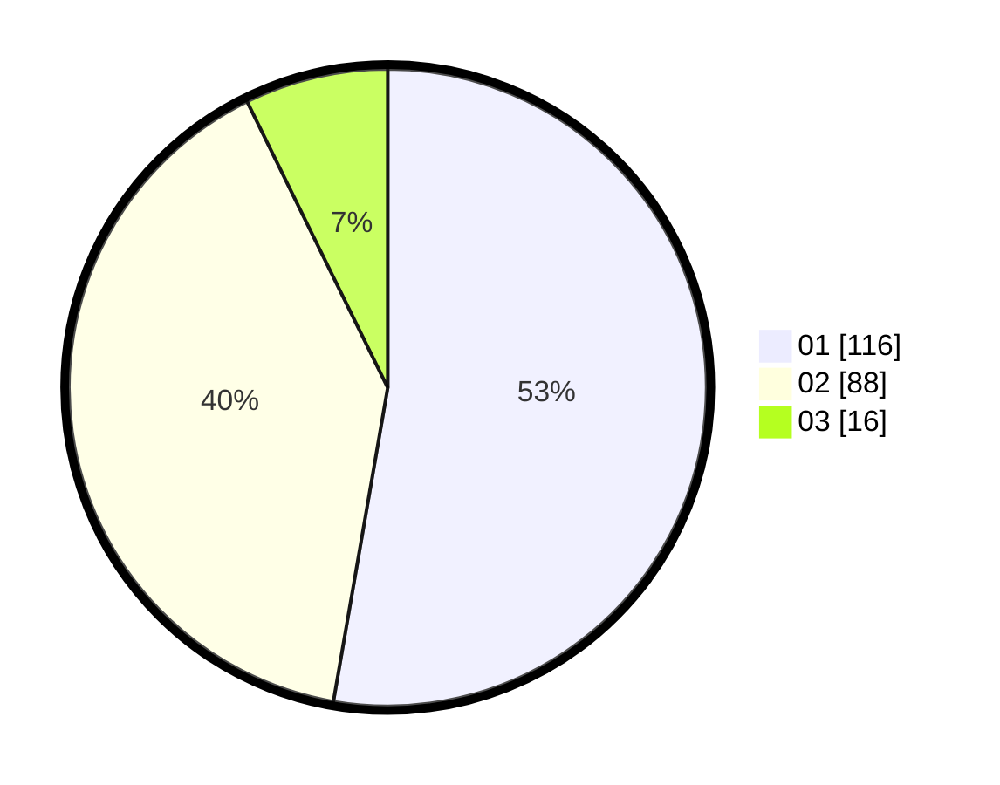

# Hasil

Hasil perolehan suara paslon dapat dilihat pada file paslon-01.txt, paslon-02.txt, dan paslon-03.txt.

Jika tidak ada, artinya data tersebut belum ada pada SIREKAP.

## Perolehan Suara

 * Paslon 01: **116**.
 * Paslon 02: **88**.
 * Paslon 03: **16**.

## Foto C Plano

https://sirekap-obj-formc.kpu.go.id/83ad/pemilu/ppwp/31/75/08/10/04/3175081004040-20240214-220514--8b25b250-e054-414e-a2ba-1eb594334878.jpg

https://sirekap-obj-formc.kpu.go.id/83ad/pemilu/ppwp/31/75/08/10/04/3175081004040-20240214-220632--1703ed52-c4fa-4aca-8082-191d3862d255.jpg

https://sirekap-obj-formc.kpu.go.id/83ad/pemilu/ppwp/31/75/08/10/04/3175081004040-20240214-220832--d4d0476f-80a3-4b56-9ce4-ebe0559435d9.jpg

## DATA PEMILIH TETAP

Jumlah pemilih dalam DPT: **258**.
 * L: **130**.
 * P: **128**.

## DATA PENGGUNA HAK PILIH

Jumlah pengguna hak pilih dalam DPT: **217**.
 * L: **105**.
 * P: **112**.

Jumlah pengguna hak pilih dalam DPTb: **6**.
 * L: **3**.
 * P: **3**.

Jumlah pengguna hak pilih dalam DPK: **4**.
 * L: **3**.
 * P: **1**.

Jumlah pengguna hak pilih: **227**.
 * L: **111**.
 * P: **116**.

## JUMLAH SUARA SAH DAN TIDAK SAH

JUMLAH SELURUH SUARA SAH: **220**.

JUMLAH SUARA TIDAK SAH: **7**.

JUMLAH SELURUH SUARA SAH DAN SUARA TIDAK SAH: **227**.
