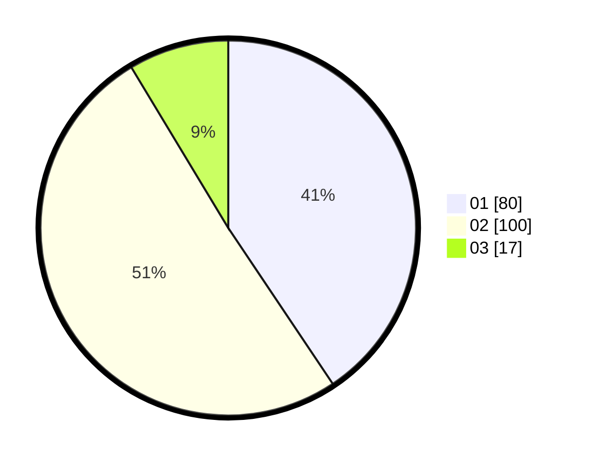

# Hasil

Hasil perolehan suara paslon dapat dilihat pada file paslon-01.txt, paslon-02.txt, dan paslon-03.txt.

Jika tidak ada, artinya data tersebut belum ada pada SIREKAP.

## Perolehan Suara

 * Paslon 01: **80**.
 * Paslon 02: **100**.
 * Paslon 03: **17**.

## Foto C Plano

https://sirekap-obj-formc.kpu.go.id/76f3/pemilu/ppwp/31/75/08/10/04/3175081004045-20240214-224707--6b5b0bfc-b296-4b51-8aed-2358c172a6e3.jpg

https://sirekap-obj-formc.kpu.go.id/76f3/pemilu/ppwp/31/75/08/10/04/3175081004045-20240214-224827--911ae128-0528-414f-92b0-17ad907c9796.jpg

https://sirekap-obj-formc.kpu.go.id/76f3/pemilu/ppwp/31/75/08/10/04/3175081004045-20240214-225008--15f914d5-5515-407e-8fc3-ac0b40cf173d.jpg
