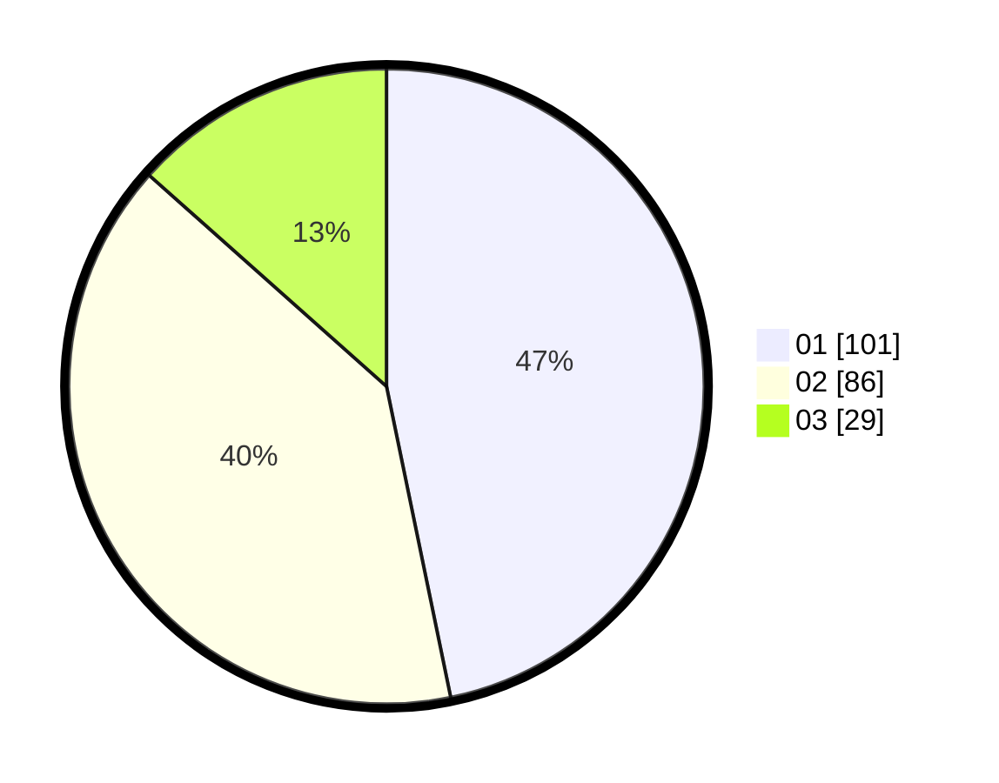

# Hasil

Hasil perolehan suara paslon dapat dilihat pada file paslon-01.txt, paslon-02.txt, dan paslon-03.txt.

Jika tidak ada, artinya data tersebut belum ada pada SIREKAP.

## Perolehan Suara

 * Paslon 01: **101**.
 * Paslon 02: **86**.
 * Paslon 03: **29**.

## Foto C Plano

https://sirekap-obj-formc.kpu.go.id/e733/pemilu/ppwp/31/75/08/10/04/3175081004046-20240214-213823--ce35e58b-177d-48e2-bcc4-52d0648dc106.jpg

https://sirekap-obj-formc.kpu.go.id/e733/pemilu/ppwp/31/75/08/10/04/3175081004046-20240214-204109--930dccd8-c047-4166-a400-55ca0e5c733b.jpg

https://sirekap-obj-formc.kpu.go.id/e733/pemilu/ppwp/31/75/08/10/04/3175081004046-20240214-204348--e27c88c7-c0bf-407e-a564-64fe04a2df3c.jpg

## DATA PEMILIH TETAP

Jumlah pemilih dalam DPT: **262**.
 * L: **129**.
 * P: **133**.

## DATA PENGGUNA HAK PILIH

Jumlah pengguna hak pilih dalam DPT: **219**.
 * L: **101**.
 * P: **118**.

Jumlah pengguna hak pilih dalam DPTb: **1**.
 * L: **0**.
 * P: **1**.

Jumlah pengguna hak pilih dalam DPK: **1**.
 * L: **0**.
 * P: **1**.

Jumlah pengguna hak pilih: **221**.
 * L: **101**.
 * P: **120**.

## JUMLAH SUARA SAH DAN TIDAK SAH

JUMLAH SELURUH SUARA SAH: **216**.

JUMLAH SUARA TIDAK SAH: **5**.

JUMLAH SELURUH SUARA SAH DAN SUARA TIDAK SAH: **221**.
