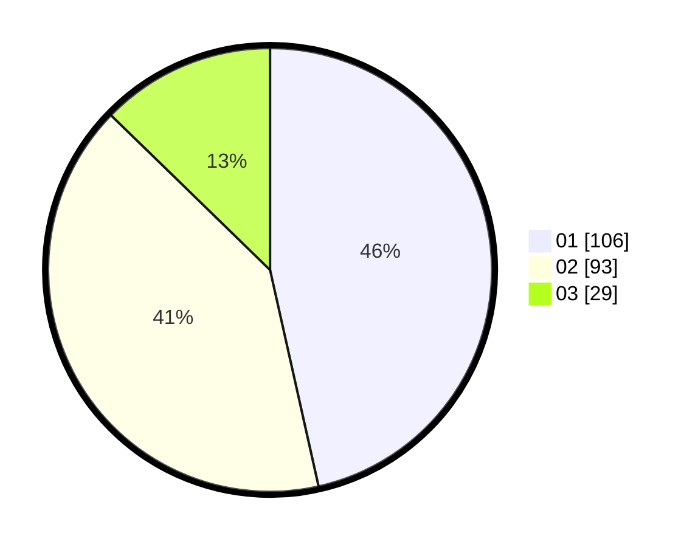

# Hasil

Hasil perolehan suara paslon dapat dilihat pada file paslon-01.txt, paslon-02.txt, dan paslon-03.txt.

Jika tidak ada, artinya data tersebut belum ada pada SIREKAP.

## Perolehan Suara

 * Paslon 01: **106**.
 * Paslon 02: **93**.
 * Paslon 03: **29**.

## Foto C Plano

https://sirekap-obj-formc.kpu.go.id/3df7/pemilu/ppwp/31/75/08/10/04/3175081004048-20240215-065428--4857c385-d422-40f5-a3f1-80ecc1f4334b.jpg

https://sirekap-obj-formc.kpu.go.id/3df7/pemilu/ppwp/31/75/08/10/04/3175081004048-20240215-065436--07dc7f7e-9390-4dad-b441-8e71e64b1f0c.jpg

https://sirekap-obj-formc.kpu.go.id/3df7/pemilu/ppwp/31/75/08/10/04/3175081004048-20240215-065444--691fada6-92e2-43b1-b5e1-11612ed295e0.jpg
