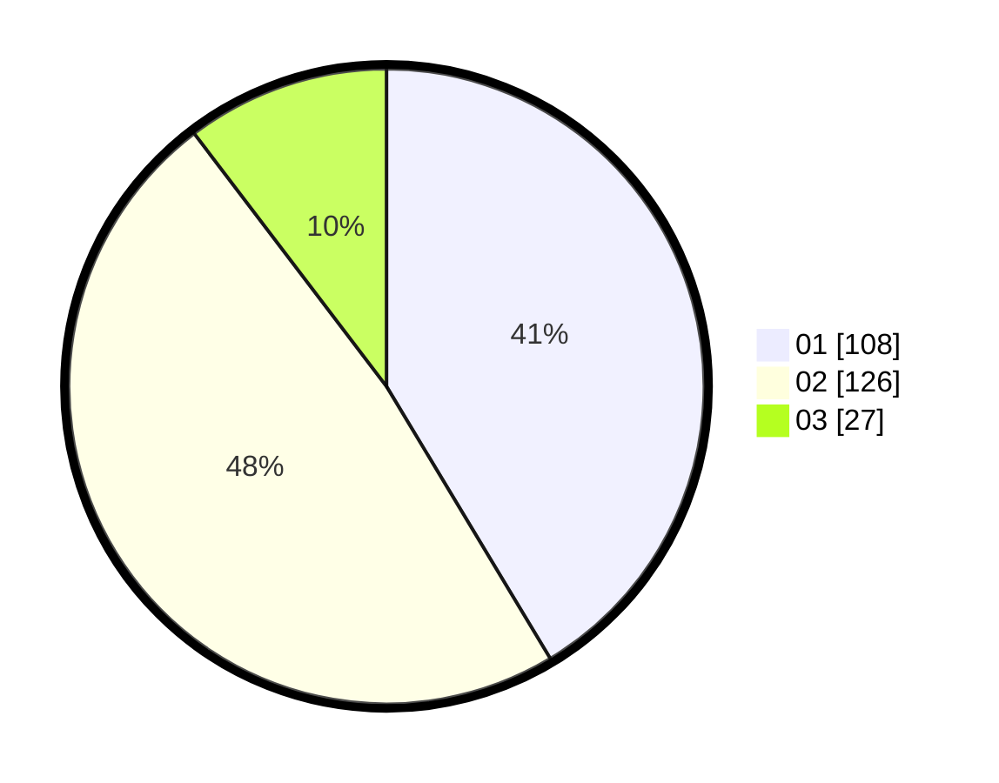

# Hasil

Hasil perolehan suara paslon dapat dilihat pada file paslon-01.txt, paslon-02.txt, dan paslon-03.txt.

Jika tidak ada, artinya data tersebut belum ada pada SIREKAP.

## Perolehan Suara

 * Paslon 01: **108**.
 * Paslon 02: **126**.
 * Paslon 03: **27**.

## Foto C Plano

https://sirekap-obj-formc.kpu.go.id/5361/pemilu/ppwp/31/75/08/10/04/3175081004050-20240215-000011--33123268-4351-4e04-b01e-232b3aa295b6.jpg

https://sirekap-obj-formc.kpu.go.id/5361/pemilu/ppwp/31/75/08/10/04/3175081004050-20240215-000210--37001247-5831-48e2-b47e-e17ae90a196e.jpg

https://sirekap-obj-formc.kpu.go.id/5361/pemilu/ppwp/31/75/08/10/04/3175081004050-20240215-000450--d9ffbb65-3596-4350-aeeb-546c0a5a2ca0.jpg
