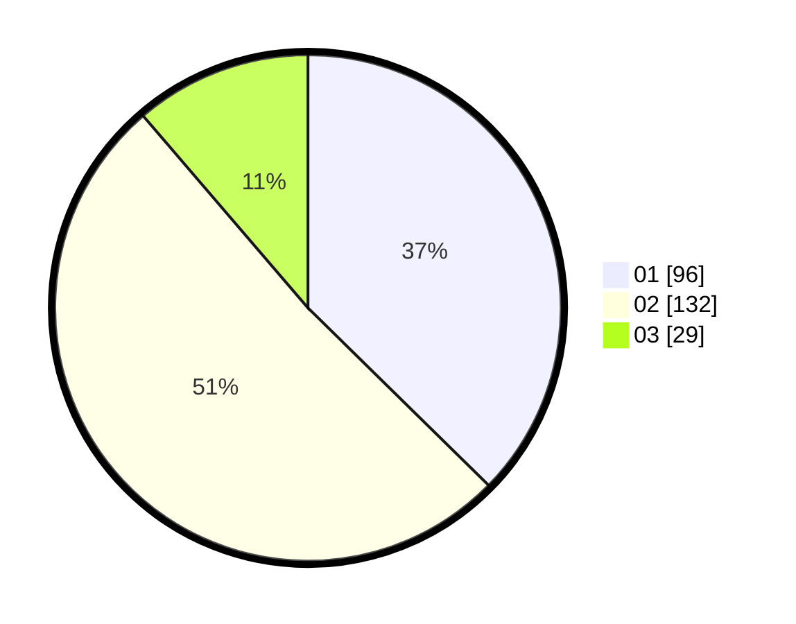

# Hasil

Hasil perolehan suara paslon dapat dilihat pada file paslon-01.txt, paslon-02.txt, dan paslon-03.txt.

Jika tidak ada, artinya data tersebut belum ada pada SIREKAP.

## Perolehan Suara

 * Paslon 01: **96**.
 * Paslon 02: **132**.
 * Paslon 03: **29**.

## Foto C Plano

https://sirekap-obj-formc.kpu.go.id/0073/pemilu/ppwp/31/75/08/10/04/3175081004052-20240214-210551--914d1c01-8b04-488c-bacf-76d60ede5a39.jpg

https://sirekap-obj-formc.kpu.go.id/0073/pemilu/ppwp/31/75/08/10/04/3175081004052-20240214-210436--26c5eb52-ccf5-401f-b626-e6489abb8e2d.jpg

https://sirekap-obj-formc.kpu.go.id/0073/pemilu/ppwp/31/75/08/10/04/3175081004052-20240215-011328--09939971-1c00-4cb4-ad3b-f866fce8a331.jpg

## DATA PEMILIH TETAP

Jumlah pemilih dalam DPT: **254**.
 * L: **125**.
 * P: **129**.

## DATA PENGGUNA HAK PILIH

Jumlah pengguna hak pilih dalam DPT: **257**.
 * L: **125**.
 * P: **132**.

Jumlah pengguna hak pilih dalam DPTb: **0**.
 * L: **0**.
 * P: **0**.

Jumlah pengguna hak pilih dalam DPK: **3**.
 * L: **0**.
 * P: **3**.

Jumlah pengguna hak pilih: **257**.
 * L: **125**.
 * P: **132**.

## JUMLAH SUARA SAH DAN TIDAK SAH

JUMLAH SELURUH SUARA SAH: **257**.

JUMLAH SUARA TIDAK SAH: **0**.

JUMLAH SELURUH SUARA SAH DAN SUARA TIDAK SAH: **257**.
