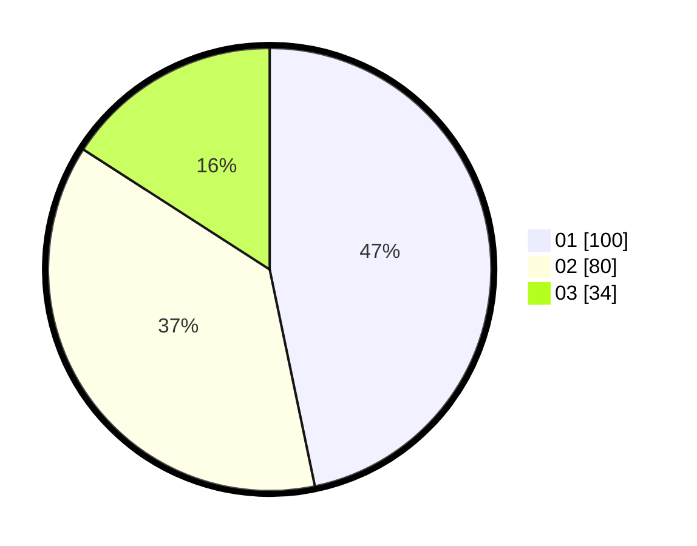

# Hasil

Hasil perolehan suara paslon dapat dilihat pada file paslon-01.txt, paslon-02.txt, dan paslon-03.txt.

Jika tidak ada, artinya data tersebut belum ada pada SIREKAP.

## Perolehan Suara

 * Paslon 01: **100**.
 * Paslon 02: **80**.
 * Paslon 03: **34**.

## Foto C Plano

https://sirekap-obj-formc.kpu.go.id/8d29/pemilu/ppwp/31/75/08/10/04/3175081004060-20240215-034749--825f626d-ee05-4a9b-9edd-d67daf9067ad.jpg

https://sirekap-obj-formc.kpu.go.id/8d29/pemilu/ppwp/31/75/08/10/04/3175081004060-20240215-035027--69672b8f-7783-4434-8b26-93f83d1d729e.jpg

https://sirekap-obj-formc.kpu.go.id/8d29/pemilu/ppwp/31/75/08/10/04/3175081004060-20240215-035232--0e2ad437-9d6d-4b94-a6a4-78d41f47ca28.jpg
