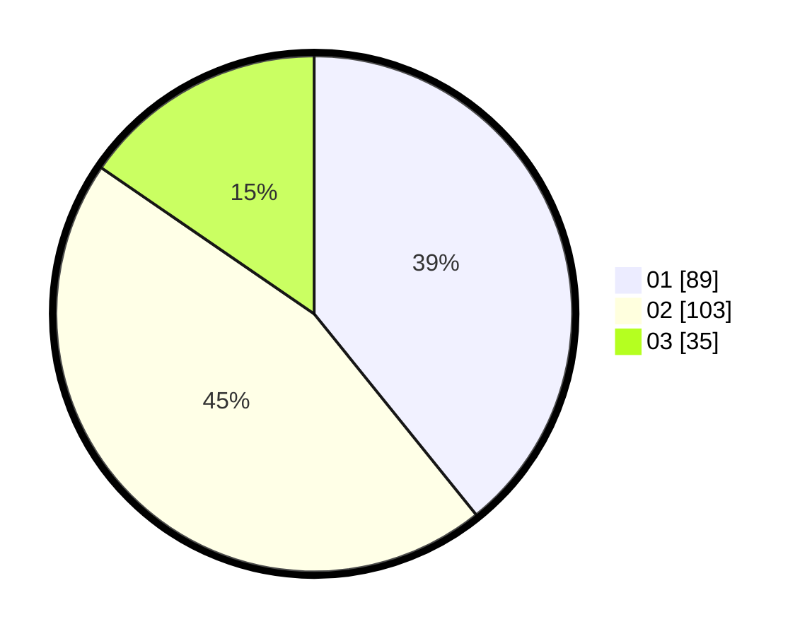

# Hasil

Hasil perolehan suara paslon dapat dilihat pada file paslon-01.txt, paslon-02.txt, dan paslon-03.txt.

Jika tidak ada, artinya data tersebut belum ada pada SIREKAP.

## Perolehan Suara

 * Paslon 01: **89**.
 * Paslon 02: **103**.
 * Paslon 03: **35**.

## Foto C Plano

https://sirekap-obj-formc.kpu.go.id/acb1/pemilu/ppwp/31/75/08/10/04/3175081004069-20240215-005742--957e0bd5-92e4-40a6-9806-4b9c5ef3d5ce.jpg

https://sirekap-obj-formc.kpu.go.id/acb1/pemilu/ppwp/31/75/08/10/04/3175081004069-20240215-005803--0e3b70af-cab3-47c2-98cd-712ad7977a36.jpg

https://sirekap-obj-formc.kpu.go.id/acb1/pemilu/ppwp/31/75/08/10/04/3175081004069-20240215-005821--b42e71e5-9f2d-4a33-83ba-c54170e47785.jpg

## DATA PEMILIH TETAP

Jumlah pemilih dalam DPT: **297**.
 * L: **99**.
 * P: **198**.

## DATA PENGGUNA HAK PILIH

Jumlah pengguna hak pilih dalam DPT: **216**.
 * L: **63**.
 * P: **153**.

Jumlah pengguna hak pilih dalam DPTb: **6**.
 * L: **3**.
 * P: **3**.

Jumlah pengguna hak pilih dalam DPK: **6**.
 * L: **3**.
 * P: **3**.

Jumlah pengguna hak pilih: **228**.
 * L: **69**.
 * P: **159**.

## JUMLAH SUARA SAH DAN TIDAK SAH

JUMLAH SELURUH SUARA SAH: **227**.

JUMLAH SUARA TIDAK SAH: **1**.

JUMLAH SELURUH SUARA SAH DAN SUARA TIDAK SAH: **228**.
