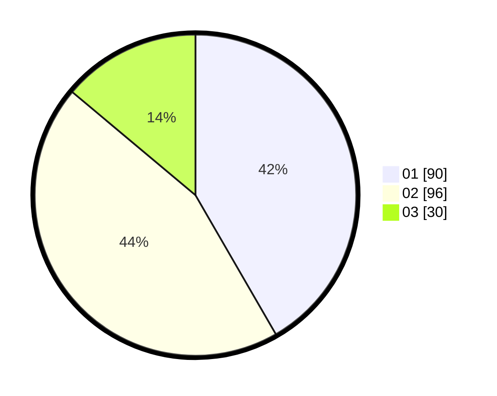

# Hasil

Hasil perolehan suara paslon dapat dilihat pada file paslon-01.txt, paslon-02.txt, dan paslon-03.txt.

Jika tidak ada, artinya data tersebut belum ada pada SIREKAP.

## Perolehan Suara

 * Paslon 01: **90**.
 * Paslon 02: **96**.
 * Paslon 03: **30**.

## Foto C Plano

https://sirekap-obj-formc.kpu.go.id/2bcf/pemilu/ppwp/31/75/08/10/04/3175081004071-20240214-231342--2e90d73b-49fa-48dd-9f10-691b459325f6.jpg

https://sirekap-obj-formc.kpu.go.id/2bcf/pemilu/ppwp/31/75/08/10/04/3175081004071-20240214-234131--0d9d5d95-7d17-4d8a-883b-0a1a4830e644.jpg

https://sirekap-obj-formc.kpu.go.id/2bcf/pemilu/ppwp/31/75/08/10/04/3175081004071-20240214-233413--1ccfc6bb-0de4-4b6c-8bd7-42f826ebb9bf.jpg
