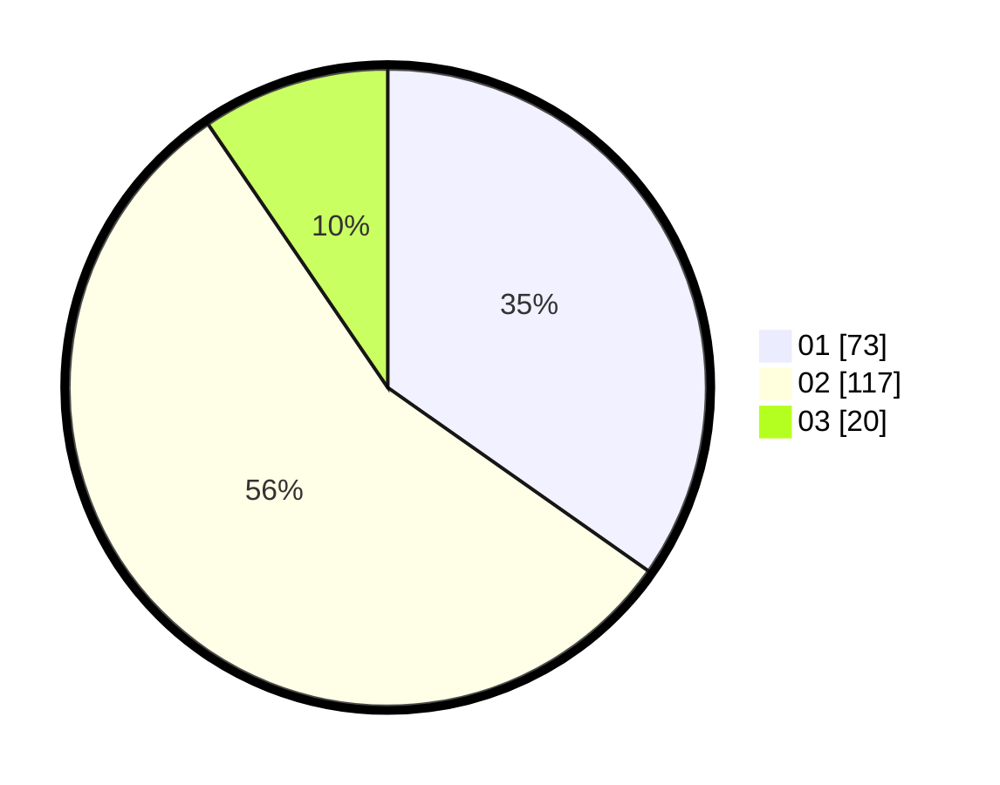

# Hasil

Hasil perolehan suara paslon dapat dilihat pada file paslon-01.txt, paslon-02.txt, dan paslon-03.txt.

Jika tidak ada, artinya data tersebut belum ada pada SIREKAP.

## Perolehan Suara

 * Paslon 01: **73**.
 * Paslon 02: **117**.
 * Paslon 03: **20**.

## Foto C Plano

https://sirekap-obj-formc.kpu.go.id/14dd/pemilu/ppwp/31/75/08/10/04/3175081004078-20240214-155244--bbfa8b0e-5185-4043-8397-deccdf18e8ec.jpg

https://sirekap-obj-formc.kpu.go.id/14dd/pemilu/ppwp/31/75/08/10/04/3175081004078-20240214-155030--b7003a60-8f3e-49f4-a1b1-15d7f8a78a18.jpg

https://sirekap-obj-formc.kpu.go.id/14dd/pemilu/ppwp/31/75/08/10/04/3175081004078-20240214-155530--9a4d988a-8070-40a9-b91f-21e6e1e1f07e.jpg

## DATA PEMILIH TETAP

Jumlah pemilih dalam DPT: **258**.
 * L: **91**.
 * P: **167**.

## DATA PENGGUNA HAK PILIH

Jumlah pengguna hak pilih dalam DPT: **202**.
 * L: **60**.
 * P: **142**.

Jumlah pengguna hak pilih dalam DPTb: **2**.
 * L: **1**.
 * P: **1**.

Jumlah pengguna hak pilih dalam DPK: **8**.
 * L: **3**.
 * P: **5**.

Jumlah pengguna hak pilih: **212**.
 * L: **64**.
 * P: **148**.

## JUMLAH SUARA SAH DAN TIDAK SAH

JUMLAH SELURUH SUARA SAH: **210**.

JUMLAH SUARA TIDAK SAH: **2**.

JUMLAH SELURUH SUARA SAH DAN SUARA TIDAK SAH: **212**.
