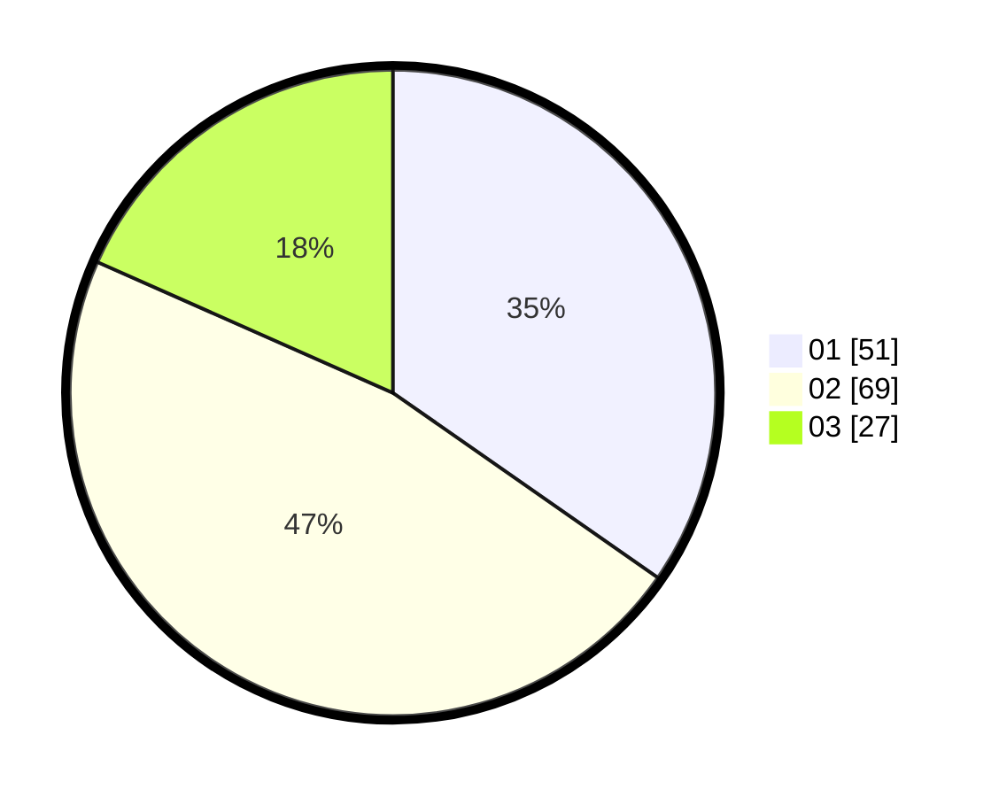

# Hasil

Hasil perolehan suara paslon dapat dilihat pada file paslon-01.txt, paslon-02.txt, dan paslon-03.txt.

Jika tidak ada, artinya data tersebut belum ada pada SIREKAP.

## Perolehan Suara

 * Paslon 01: **51**.
 * Paslon 02: **69**.
 * Paslon 03: **27**.

## Foto C Plano

https://sirekap-obj-formc.kpu.go.id/00e9/pemilu/ppwp/31/75/08/10/05/3175081005005-20240216-081246--eca18cd8-bb66-4898-a10f-69a7e7517156.jpg

https://sirekap-obj-formc.kpu.go.id/00e9/pemilu/ppwp/31/75/08/10/05/3175081005005-20240216-081250--9fa1f562-1872-4c08-8218-ee3446f94842.jpg

https://sirekap-obj-formc.kpu.go.id/00e9/pemilu/ppwp/31/75/08/10/05/3175081005005-20240216-081247--13718729-348e-4e25-a1d8-ca59e9ae4976.jpg

## DATA PEMILIH TETAP

Jumlah pemilih dalam DPT: **287**.
 * L: **151**.
 * P: **136**.

## DATA PENGGUNA HAK PILIH

Jumlah pengguna hak pilih dalam DPT: **242**.
 * L: **124**.
 * P: **118**.

Jumlah pengguna hak pilih dalam DPTb: **3**.
 * L: **2**.
 * P: **1**.

Jumlah pengguna hak pilih dalam DPK: **7**.
 * L: **3**.
 * P: **4**.

Jumlah pengguna hak pilih: **252**.
 * L: **129**.
 * P: **123**.

## JUMLAH SUARA SAH DAN TIDAK SAH

JUMLAH SELURUH SUARA SAH: **247**.

JUMLAH SUARA TIDAK SAH: **5**.

JUMLAH SELURUH SUARA SAH DAN SUARA TIDAK SAH: **252**.
