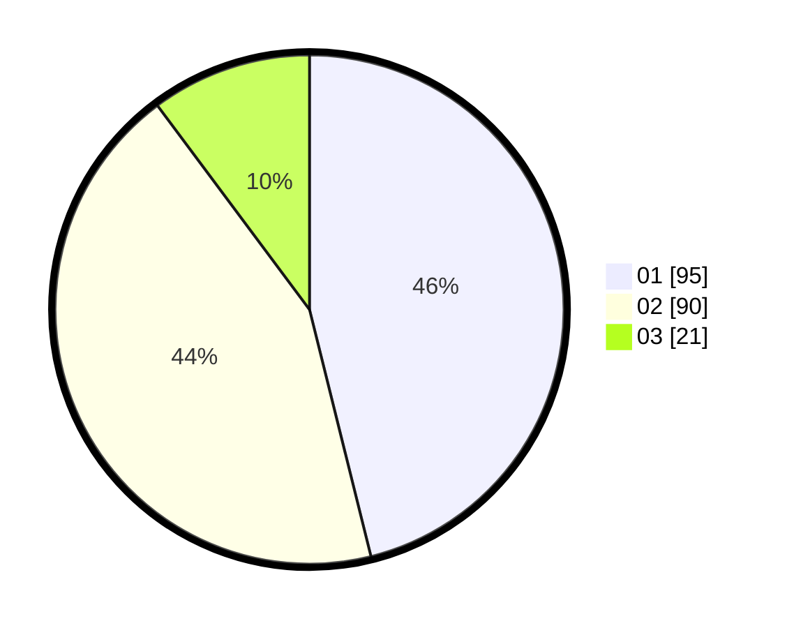

# Hasil

Hasil perolehan suara paslon dapat dilihat pada file paslon-01.txt, paslon-02.txt, dan paslon-03.txt.

Jika tidak ada, artinya data tersebut belum ada pada SIREKAP.

## Perolehan Suara

 * Paslon 01: **95**.
 * Paslon 02: **90**.
 * Paslon 03: **21**.

## Foto C Plano

https://sirekap-obj-formc.kpu.go.id/d12f/pemilu/ppwp/31/75/08/10/05/3175081005012-20240215-002125--84dca0c0-cf06-4ac9-a0e4-3b1382e6d31f.jpg

https://sirekap-obj-formc.kpu.go.id/d12f/pemilu/ppwp/31/75/08/10/05/3175081005012-20240215-002414--31e43ae8-5cc4-4dd8-8680-e2e6e026b8af.jpg

https://sirekap-obj-formc.kpu.go.id/d12f/pemilu/ppwp/31/75/08/10/05/3175081005012-20240215-002813--f4402730-ebf3-4acd-9bf0-ec336e00f2fc.jpg

## DATA PEMILIH TETAP

Jumlah pemilih dalam DPT: **272**.
 * L: **143**.
 * P: **129**.

## DATA PENGGUNA HAK PILIH

Jumlah pengguna hak pilih dalam DPT: **203**.
 * L: **103**.
 * P: **100**.

Jumlah pengguna hak pilih dalam DPTb: **2**.
 * L: **1**.
 * P: **1**.

Jumlah pengguna hak pilih dalam DPK: **2**.
 * L: **2**.
 * P: **0**.

Jumlah pengguna hak pilih: **207**.
 * L: **106**.
 * P: **101**.

## JUMLAH SUARA SAH DAN TIDAK SAH

JUMLAH SELURUH SUARA SAH: **206**.

JUMLAH SUARA TIDAK SAH: **1**.

JUMLAH SELURUH SUARA SAH DAN SUARA TIDAK SAH: **207**.
