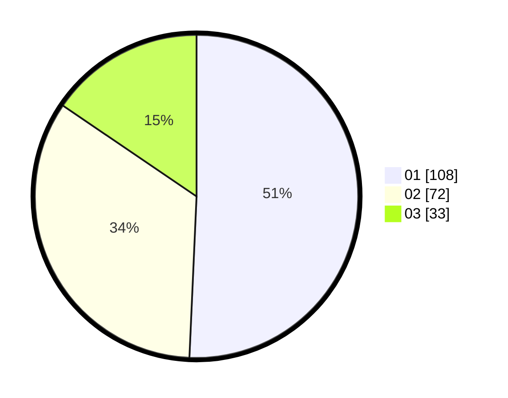

# Hasil

Hasil perolehan suara paslon dapat dilihat pada file paslon-01.txt, paslon-02.txt, dan paslon-03.txt.

Jika tidak ada, artinya data tersebut belum ada pada SIREKAP.

## Perolehan Suara

 * Paslon 01: **108**.
 * Paslon 02: **72**.
 * Paslon 03: **33**.

## Foto C Plano

https://sirekap-obj-formc.kpu.go.id/077d/pemilu/ppwp/31/75/08/10/05/3175081005014-20240214-194556--e2d9bc1a-73bb-4499-aea1-ae1423916da0.jpg

https://sirekap-obj-formc.kpu.go.id/077d/pemilu/ppwp/31/75/08/10/05/3175081005014-20240214-203023--813398a7-b512-4a1d-b2a3-f6b7980ebbcd.jpg

https://sirekap-obj-formc.kpu.go.id/077d/pemilu/ppwp/31/75/08/10/05/3175081005014-20240214-194951--484e0c9b-a632-48a8-85d5-ba92ec30046a.jpg

## DATA PEMILIH TETAP

Jumlah pemilih dalam DPT: **270**.
 * L: **137**.
 * P: **133**.

## DATA PENGGUNA HAK PILIH

Jumlah pengguna hak pilih dalam DPT: **214**.
 * L: **104**.
 * P: **110**.

Jumlah pengguna hak pilih dalam DPTb: **0**.
 * L: **0**.
 * P: **0**.

Jumlah pengguna hak pilih dalam DPK: **0**.
 * L: **0**.
 * P: **0**.

Jumlah pengguna hak pilih: **214**.
 * L: **104**.
 * P: **110**.

## JUMLAH SUARA SAH DAN TIDAK SAH

JUMLAH SELURUH SUARA SAH: **213**.

JUMLAH SUARA TIDAK SAH: **1**.

JUMLAH SELURUH SUARA SAH DAN SUARA TIDAK SAH: **214**.
