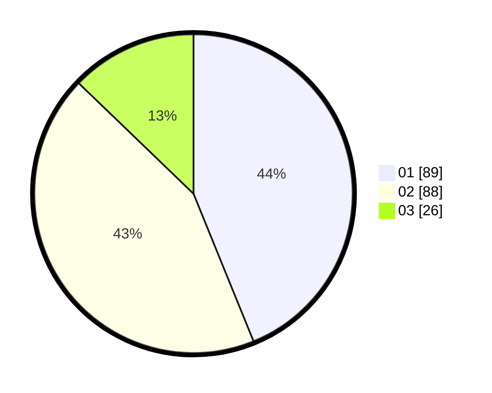

# Hasil

Hasil perolehan suara paslon dapat dilihat pada file paslon-01.txt, paslon-02.txt, dan paslon-03.txt.

Jika tidak ada, artinya data tersebut belum ada pada SIREKAP.

## Perolehan Suara

 * Paslon 01: **89**.
 * Paslon 02: **88**.
 * Paslon 03: **26**.

## Foto C Plano

https://sirekap-obj-formc.kpu.go.id/7133/pemilu/ppwp/31/75/08/10/05/3175081005015-20240214-195945--a8dfe768-9ea1-4a5a-ba1a-7c155eed3219.jpg

https://sirekap-obj-formc.kpu.go.id/7133/pemilu/ppwp/31/75/08/10/05/3175081005015-20240214-200015--11788781-a278-43ec-b01c-c552bd3ffec8.jpg

https://sirekap-obj-formc.kpu.go.id/7133/pemilu/ppwp/31/75/08/10/05/3175081005015-20240214-200054--f29a676b-2019-4380-9f48-b4080eec96f7.jpg

## DATA PEMILIH TETAP

Jumlah pemilih dalam DPT: **271**.
 * L: **142**.
 * P: **129**.

## DATA PENGGUNA HAK PILIH

Jumlah pengguna hak pilih dalam DPT: **204**.
 * L: **107**.
 * P: **97**.

Jumlah pengguna hak pilih dalam DPTb: **0**.
 * L: **0**.
 * P: **0**.

Jumlah pengguna hak pilih dalam DPK: **1**.
 * L: **1**.
 * P: **0**.

Jumlah pengguna hak pilih: **205**.
 * L: **108**.
 * P: **97**.

## JUMLAH SUARA SAH DAN TIDAK SAH

JUMLAH SELURUH SUARA SAH: **203**.

JUMLAH SUARA TIDAK SAH: **2**.

JUMLAH SELURUH SUARA SAH DAN SUARA TIDAK SAH: **205**.
