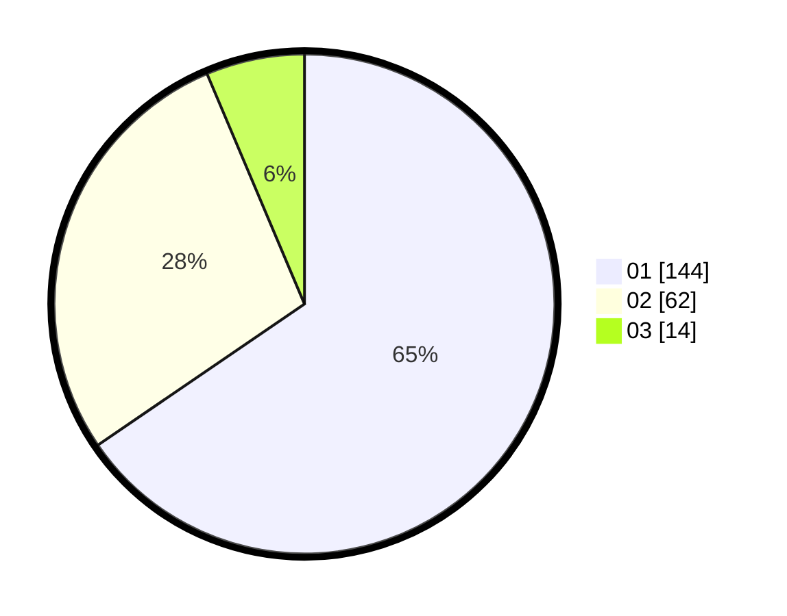

# Hasil

Hasil perolehan suara paslon dapat dilihat pada file paslon-01.txt, paslon-02.txt, dan paslon-03.txt.

Jika tidak ada, artinya data tersebut belum ada pada SIREKAP.

## Perolehan Suara

 * Paslon 01: **144**.
 * Paslon 02: **62**.
 * Paslon 03: **14**.

## Foto C Plano

https://sirekap-obj-formc.kpu.go.id/c88e/pemilu/ppwp/31/75/08/10/05/3175081005017-20240214-202851--a4e21ebc-9f59-45ab-8321-39be3f8a43b2.jpg

https://sirekap-obj-formc.kpu.go.id/c88e/pemilu/ppwp/31/75/08/10/05/3175081005017-20240214-202859--a54fad7b-94f6-4682-8e94-68c57851de3a.jpg

https://sirekap-obj-formc.kpu.go.id/c88e/pemilu/ppwp/31/75/08/10/05/3175081005017-20240214-233944--b4b36d26-3ba5-4e82-84e3-05592625a46e.jpg

## DATA PEMILIH TETAP

Jumlah pemilih dalam DPT: **272**.
 * L: **130**.
 * P: **142**.

## DATA PENGGUNA HAK PILIH

Jumlah pengguna hak pilih dalam DPT: **226**.
 * L: **109**.
 * P: **117**.

Jumlah pengguna hak pilih dalam DPTb: **0**.
 * L: **0**.
 * P: **0**.

Jumlah pengguna hak pilih dalam DPK: **3**.
 * L: **2**.
 * P: **1**.

Jumlah pengguna hak pilih: **229**.
 * L: **111**.
 * P: **118**.

## JUMLAH SUARA SAH DAN TIDAK SAH

JUMLAH SELURUH SUARA SAH: **220**.

JUMLAH SUARA TIDAK SAH: **9**.

JUMLAH SELURUH SUARA SAH DAN SUARA TIDAK SAH: **229**.
