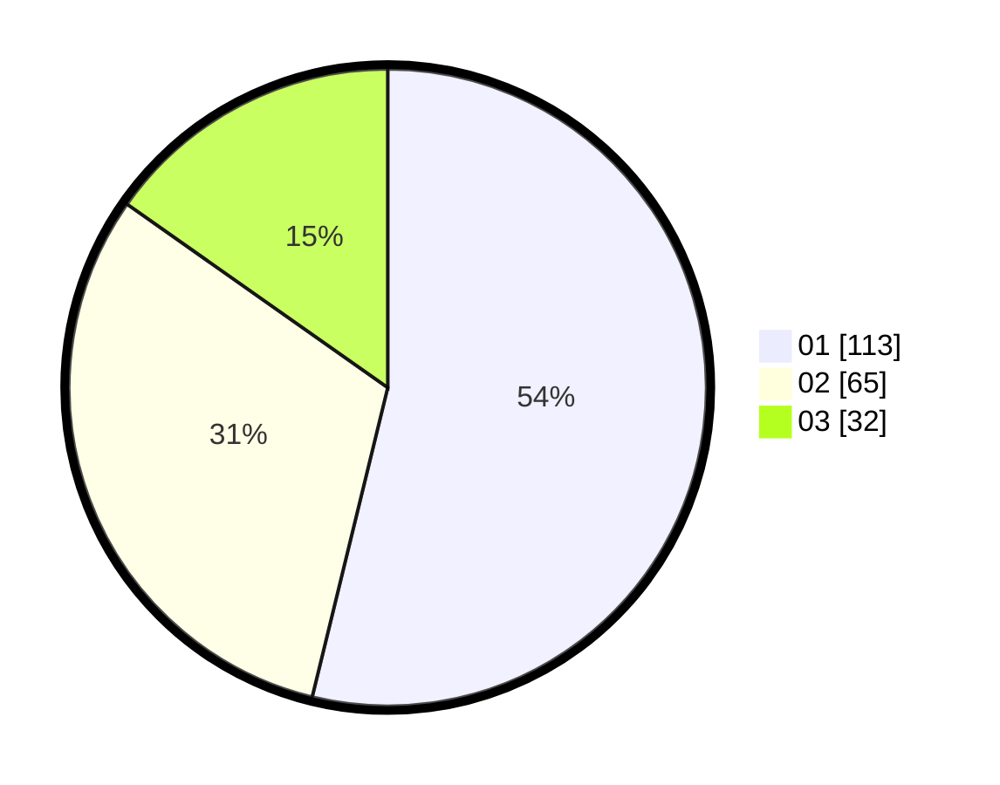

# Hasil

Hasil perolehan suara paslon dapat dilihat pada file paslon-01.txt, paslon-02.txt, dan paslon-03.txt.

Jika tidak ada, artinya data tersebut belum ada pada SIREKAP.

## Perolehan Suara

 * Paslon 01: **113**.
 * Paslon 02: **65**.
 * Paslon 03: **32**.

## Foto C Plano

https://sirekap-obj-formc.kpu.go.id/223d/pemilu/ppwp/31/75/08/10/05/3175081005018-20240216-013040--006de56b-e979-4bef-af5e-637efd633f10.jpg

https://sirekap-obj-formc.kpu.go.id/223d/pemilu/ppwp/31/75/08/10/05/3175081005018-20240216-013042--12914370-4d11-4eca-9868-0304df5c364a.jpg

https://sirekap-obj-formc.kpu.go.id/223d/pemilu/ppwp/31/75/08/10/05/3175081005018-20240216-013041--03174dd3-04bf-43a8-83fc-8665636953d7.jpg

## DATA PEMILIH TETAP

Jumlah pemilih dalam DPT: **259**.
 * L: **122**.
 * P: **137**.

## DATA PENGGUNA HAK PILIH

Jumlah pengguna hak pilih dalam DPT: **216**.
 * L: **98**.
 * P: **118**.

Jumlah pengguna hak pilih dalam DPTb: **0**.
 * L: **0**.
 * P: **0**.

Jumlah pengguna hak pilih dalam DPK: **1**.
 * L: **1**.
 * P: **0**.

Jumlah pengguna hak pilih: **217**.
 * L: **99**.
 * P: **118**.

## JUMLAH SUARA SAH DAN TIDAK SAH

JUMLAH SELURUH SUARA SAH: **210**.

JUMLAH SUARA TIDAK SAH: **7**.

JUMLAH SELURUH SUARA SAH DAN SUARA TIDAK SAH: **217**.
