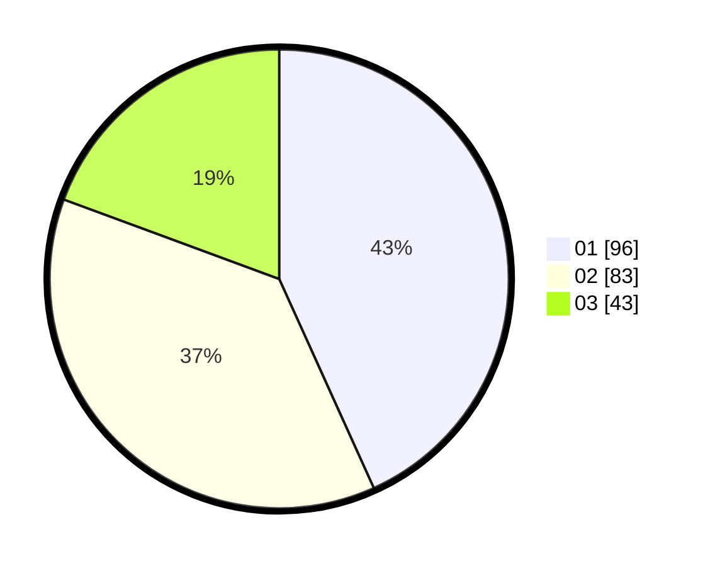

# Hasil

Hasil perolehan suara paslon dapat dilihat pada file paslon-01.txt, paslon-02.txt, dan paslon-03.txt.

Jika tidak ada, artinya data tersebut belum ada pada SIREKAP.

## Perolehan Suara

 * Paslon 01: **96**.
 * Paslon 02: **83**.
 * Paslon 03: **43**.

## Foto C Plano

https://sirekap-obj-formc.kpu.go.id/f13e/pemilu/ppwp/31/75/08/10/05/3175081005019-20240215-234034--4c4a5fc7-c9cc-43fc-ae03-a68dd69fa377.jpg

https://sirekap-obj-formc.kpu.go.id/f13e/pemilu/ppwp/31/75/08/10/05/3175081005019-20240215-234036--f2a37235-952e-4799-9935-fc96bdf56294.jpg

https://sirekap-obj-formc.kpu.go.id/f13e/pemilu/ppwp/31/75/08/10/05/3175081005019-20240215-234035--45a36b30-eeb4-4315-bdae-6bbef55ca65a.jpg

## DATA PEMILIH TETAP

Jumlah pemilih dalam DPT: **259**.
 * L: **134**.
 * P: **125**.

## DATA PENGGUNA HAK PILIH

Jumlah pengguna hak pilih dalam DPT: **219**.
 * L: **107**.
 * P: **112**.

Jumlah pengguna hak pilih dalam DPTb: **0**.
 * L: **0**.
 * P: **0**.

Jumlah pengguna hak pilih dalam DPK: **5**.
 * L: **4**.
 * P: **1**.

Jumlah pengguna hak pilih: **224**.
 * L: **111**.
 * P: **113**.

## JUMLAH SUARA SAH DAN TIDAK SAH

JUMLAH SELURUH SUARA SAH: **222**.

JUMLAH SUARA TIDAK SAH: **2**.

JUMLAH SELURUH SUARA SAH DAN SUARA TIDAK SAH: **224**.
