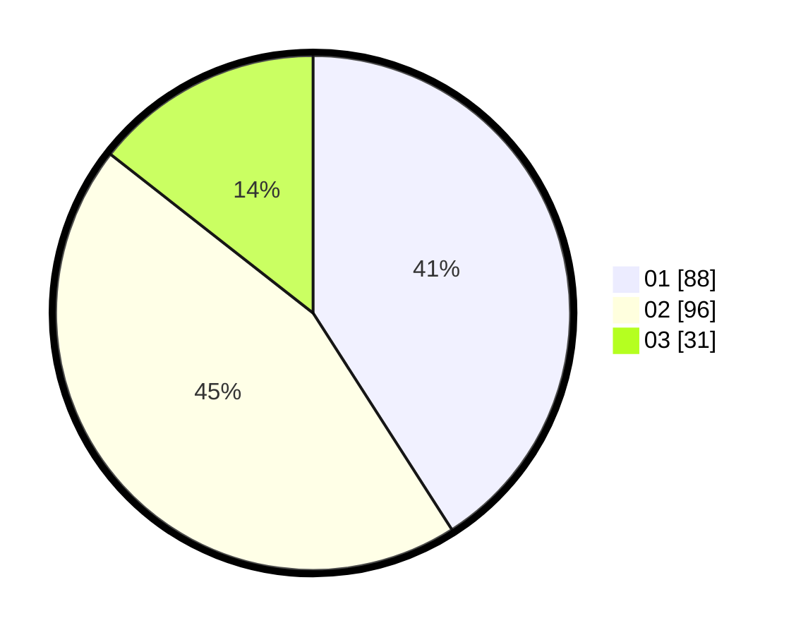

# Hasil

Hasil perolehan suara paslon dapat dilihat pada file paslon-01.txt, paslon-02.txt, dan paslon-03.txt.

Jika tidak ada, artinya data tersebut belum ada pada SIREKAP.

## Perolehan Suara

 * Paslon 01: **88**.
 * Paslon 02: **96**.
 * Paslon 03: **31**.

## Foto C Plano

https://sirekap-obj-formc.kpu.go.id/0dea/pemilu/ppwp/31/75/08/10/05/3175081005020-20240216-121634--003983ad-c56b-4d39-a4d0-e181200ccb9b.jpg

https://sirekap-obj-formc.kpu.go.id/0dea/pemilu/ppwp/31/75/08/10/05/3175081005020-20240216-121643--36567aab-ef49-4033-82df-9e648f466450.jpg

https://sirekap-obj-formc.kpu.go.id/0dea/pemilu/ppwp/31/75/08/10/05/3175081005020-20240216-121637--055acd0c-3246-47c2-86be-6ed804080519.jpg

## DATA PEMILIH TETAP

Jumlah pemilih dalam DPT: **260**.
 * L: **134**.
 * P: **126**.

## DATA PENGGUNA HAK PILIH

Jumlah pengguna hak pilih dalam DPT: **220**.
 * L: **112**.
 * P: **108**.

Jumlah pengguna hak pilih dalam DPTb: **0**.
 * L: **0**.
 * P: **0**.

Jumlah pengguna hak pilih dalam DPK: **0**.
 * L: **0**.
 * P: **0**.

Jumlah pengguna hak pilih: **220**.
 * L: **112**.
 * P: **108**.

## JUMLAH SUARA SAH DAN TIDAK SAH

JUMLAH SELURUH SUARA SAH: **215**.

JUMLAH SUARA TIDAK SAH: **5**.

JUMLAH SELURUH SUARA SAH DAN SUARA TIDAK SAH: **220**.
