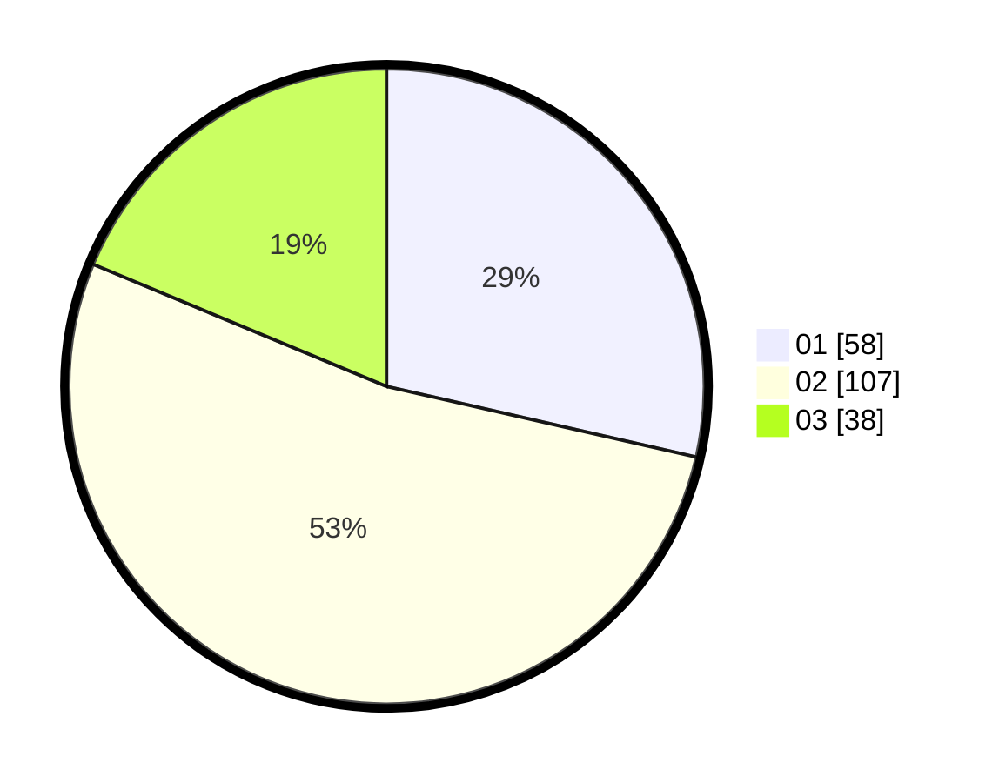

# Hasil

Hasil perolehan suara paslon dapat dilihat pada file paslon-01.txt, paslon-02.txt, dan paslon-03.txt.

Jika tidak ada, artinya data tersebut belum ada pada SIREKAP.

## Perolehan Suara

 * Paslon 01: **58**.
 * Paslon 02: **107**.
 * Paslon 03: **38**.

## Foto C Plano

https://sirekap-obj-formc.kpu.go.id/b189/pemilu/ppwp/31/75/08/10/05/3175081005021-20240216-103300--89354bd3-041b-4341-b321-a3e6105a8d14.jpg

https://sirekap-obj-formc.kpu.go.id/b189/pemilu/ppwp/31/75/08/10/05/3175081005021-20240215-010753--2eac5b34-ea58-4750-9969-9a039fed04d6.jpg

https://sirekap-obj-formc.kpu.go.id/b189/pemilu/ppwp/31/75/08/10/05/3175081005021-20240215-011149--6f5e3ea5-a094-464a-9c19-c9db73ab0a33.jpg
